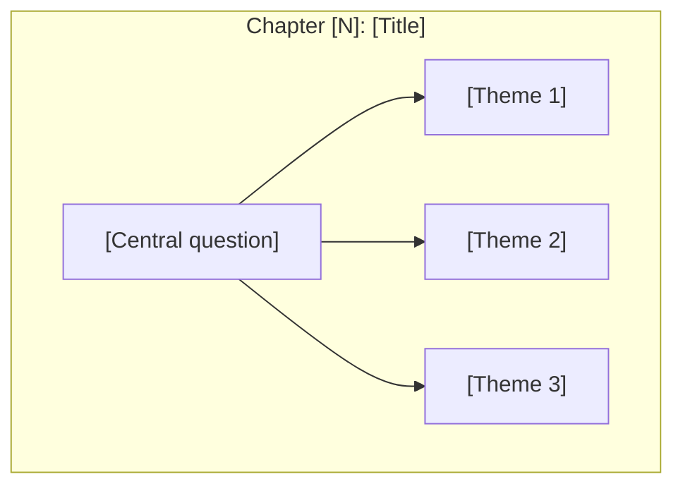

# Skill: Book to Adaptive Learning Companion

## Overview

This skill transforms a book into an **adaptive-reader companion website** featuring three reading modes and four content preference modes:

### Reading Modes
1. **Read Original** — clean e-reader view of the original book text
2. **Read Companion** — interactive Starlight visual companion with adaptive content
3. **Read Side-by-Side** — split-pane reader: original text on left, adaptive companion on right

### Content Preferences (VARK Framework)
| Label | Type | Content Format |
|-------|------|----------------|
| **See It** | Visual | Mermaid diagrams, concept maps, flowcharts, spatial layouts |
| **Hear It** | Auditory | Podcast-style scripts, dialogue explanations, conversational narrative |
| **Read It** | Read/Write | Structured text, glossary, comparison tables, definitions, bullet summaries |
| **Do It** | Kinesthetic | Exercises, worked examples, case studies, reflection questions |

**UX Framing**: User-facing language avoids discredited "learning styles" terminology. Instead:
> "How do you prefer to explore new ideas? Choose 1-2 content modes."

Additional features:
- Custom designed landing page with preference picker
- Chapter-by-chapter content in all 4 modes
- Concept maps showing idea relationships
- Cross-linked concept pages
- Guided learning paths (Beginner/Intermediate/Advanced)
- Full-text search and dark mode support
- Preference persistence via localStorage

## Prerequisites

- Node.js 18+
- Book content (PDF, EPUB, or text)
- Claude Code with file read permissions

### Version Pinning

This skill targets **Astro 5** with the standalone `render()` API. Key version requirements:

```json
{
  "astro": "^5.0.0",
  "@astrojs/starlight": "^0.32.0",
  "astro-mermaid": "^0.3.0"
}
```

> **Critical**: Astro 5 changed the content rendering API. Use `import { render } from 'astro:content'` and call `render(entry)`. Do NOT use the Astro 4 pattern `entry.render()` — it will fail with a `entry.render is not a function` error, especially for collections using the `glob` loader.

### Pre-flight Checks

Before starting, verify the environment:

```bash
# Check Node version (must be 18+)
node --version

# Check git identity (needed for commits/deploy)
git config user.name && git config user.email || echo "WARNING: git identity not set"

# Check disk space (adaptive builds with ~200 files can use ~500MB+)
df -h .
```

### Content Provenance

If the user provides a PDF/EPUB, extract text directly from it. If no source file is available, **clearly state** that content is synthesized from knowledge and may not match the original text word-for-word. Never present synthesized content as verbatim book text without disclosure.

## Architecture Decisions

| Decision | Choice | Rationale |
|----------|--------|-----------|
| Split-pane tech | Vanilla JS + CSS Grid | No React dependency; Astro renders content as HTML |
| Content storage | New `original` Astro content collection | Type-safe, queryable, cleanly separated from `docs` |
| Preference storage | `localStorage` key `learning-preferences` | Client-side, no server needed, persists across sessions |
| Default preference | `["see-it"]` | Matches visual companion behavior if no selection made |
| Content per chapter | 5 files (overview + 4 modes) | Clean separation, independent rendering |
| URL routing | Path-based with preference tabs | Clean, bookmarkable; tabs switch content without page reload |
| Navigation sync | URL-driven (both panels share chapter slug) | Simple, no client state management needed |
| Mobile fallback | Tab toggle below 768px | Side-by-side doesn't work on small screens |
| Sidebar filtering | Client-side JS | Hides non-selected preference links without rebuild |
| Skill approach | Standalone SKILL.md | Doesn't break simpler companion skills |

## Content Organization

Each chapter produces 5 content files within `src/content/docs/`:

```
chapters/
  01-chapter-slug/
    overview.md       <- Hub page: chapter summary + links to 4 modes
    see-it.md         <- Visual: Mermaid diagrams, concept maps
    hear-it.md        <- Auditory: conversational script, dialogue
    read-it.md        <- Read/Write: structured text, glossary, tables
    do-it.md          <- Kinesthetic: exercises, worked examples
  02-chapter-slug/
    overview.md
    see-it.md
    hear-it.md
    read-it.md
    do-it.md
  ...
```

No new content collections needed — everything stays in the existing `docs` collection.

## Directory Structure

```
src/
+-- pages/
|   +-- index.astro                          # Landing page (preference picker + 3 reading modes)
|   +-- read/
|       +-- original/[...slug].astro         # Original book reader
|       +-- side-by-side/[...slug].astro     # Split-pane reader with preference tabs
+-- content/
|   +-- docs/                                # Companion content (Starlight)
|   |   +-- overview.mdx
|   |   +-- chapters/
|   |   |   +-- 01-slug/
|   |   |   |   +-- overview.md
|   |   |   |   +-- see-it.md
|   |   |   |   +-- hear-it.md
|   |   |   |   +-- read-it.md
|   |   |   |   +-- do-it.md
|   |   |   +-- 02-slug/
|   |   |       +-- ...
|   |   +-- concepts/
|   |   +-- paths/
|   +-- original/                            # Original book text
|       +-- 01-chapter-slug.md
|       +-- 02-chapter-slug.md
|       +-- ...
+-- layouts/
|   +-- ReaderLayout.astro                   # Shared layout for reader pages
+-- components/
|   +-- ReadingModeToggle.astro              # Mode switcher component
|   +-- ChapterNav.astro                     # Chapter navigation component
|   +-- PreferenceSelector.astro             # Landing page preference picker
|   +-- PreferenceToggle.astro               # Reader panel preference tabs
+-- styles/
    +-- custom.css                           # Starlight theme + preference colors
    +-- reader.css                           # Reader, split-pane, & preference styles
```

---

## Workflow

### Phase 1: Book Analysis

**Step 1.1: Extract Book Structure**

```
When given a book PDF or text:

1. IDENTIFY the book's structure:
   - Title and author
   - Number of chapters/parts
   - Chapter titles
   - Section/essay breakdown within chapters

2. CREATE a structure map:
   Book: [Title]
   Author: [Author]
   Parts: [Number]
   Chapters: [Number]

   Structure:
   - Part I: [Name]
     - Chapter 1: [Title]
       - 1.1 [Essay/Section]
       - 1.2 [Essay/Section]
     - Chapter 2: [Title]
   ...

3. IDENTIFY key concepts:
   - Central thesis/main idea
   - Key terms introduced
   - Recurring themes
   - Relationships between concepts

4. EXTRACT visual identity:
   - Core metaphors or symbols from the book
   - Suggested color palette based on book themes
   - Key iconography

5. EXTRACT original text chapter-by-chapter:
   - Read through the entire book
   - Segment text by chapter boundaries
   - Preserve headings, paragraphs, blockquotes, emphasis
   - Note page numbers or section markers for reference
   - Store raw chapter text for Phase 5
```

**Step 1.1b: Genre Classification**

Classify the book into one PRIMARY genre using these signals:

| Genre | Signals |
|-------|---------|
| **TECHNICAL** | Code samples, architecture diagrams, API references, system design, algorithms, data models |
| **BUSINESS** | Frameworks, case studies, competitive analysis, market data, strategy models, org design |
| **NARRATIVE** | Chronological events, historical figures, cause-effect storytelling, scientific discoveries |
| **PHILOSOPHICAL** | Abstract arguments, thought experiments, conceptual distinctions, dialectical structure |

If the book spans genres, assign a SECONDARY genre. Tag each chapter as PRIMARY or SECONDARY during the structure map. Book-level pages (overview, concept pages) always use the PRIMARY genre.

**Step 1.1c: Load Visualization Sub-Skill**

Based on the genre classification, load the corresponding visualization sub-skill:
- TECHNICAL → `viz-technical` sub-skill
- BUSINESS → `viz-business` sub-skill
- NARRATIVE → `viz-narrative` sub-skill
- PHILOSOPHICAL → `viz-philosophical` sub-skill

If a SECONDARY genre was assigned, also load its sub-skill for chapters tagged with that genre. Use the PRIMARY genre's sub-skill for all book-level pages and the default color palette.

**Step 1.2: Concept Extraction (MODIFIED for Adaptive)**

```
For each chapter, identify:

1. CORE INSIGHT: The main idea in 1-2 sentences
2. KEY CONCEPTS: Terms or ideas introduced
3. RELATIONSHIPS: How concepts connect to:
   - Previous chapters
   - Other concepts in same chapter
   - Overall book thesis
4. VISUAL POTENTIAL (for See It mode): Use the Chapter Analysis Template
   from the loaded visualization sub-skill (Section C) to assess this
   chapter's visual content. Answer all questions in the template.
5. AUDITORY POTENTIAL (for Hear It mode): What narratives would help:
   - Rich analogies or metaphors in the text
   - Debate-worthy tensions between ideas
   - Stories or anecdotes that can be expanded
   - Concepts that benefit from conversational explanation
6. STRUCTURED-TEXT POTENTIAL (for Read It mode): What reference material would help:
   - Key terms needing formal definitions
   - Dimensions for comparison tables
   - Hierarchical breakdowns for structured summaries
   - Lists of principles, rules, or criteria
7. PRACTICAL POTENTIAL (for Do It mode): What exercises would help:
   - Real-world application scenarios
   - Decision-making frameworks to practice
   - Self-assessment opportunities
   - Case studies from the text to analyze
8. ICONIC QUOTE: A memorable quote that captures the chapter essence
9. SLUG MAPPING: Assign a consistent slug per chapter
   that will be shared between original/ and docs/chapters/ collections.
   Format: NN-chapter-slug (e.g., 01-the-beginning, 02-core-ideas)
```

---

### Phase 2: Project Setup

**Step 2.1: Initialize Astro/Starlight Project**

```bash
# Create project directory
mkdir [book-slug]-adaptive
cd [book-slug]-adaptive

# Initialize Astro with Starlight
# NOTE: npm create can timeout in automated environments.
# If it hangs, use --skip-houston and run npm install separately.
npm create astro@latest . -- --template starlight --yes --no-git --skip-houston

# Install dependencies
npm install

# Add Mermaid support
npm install astro-mermaid mermaid
```

> **Environment note**: In WSL2 or CI environments, `npm create` may timeout during dependency installation. If this happens, the project directory will exist but `node_modules/` will be empty. Simply run `npm install` manually to recover.

**Step 2.2: Configure Project**

Create `astro.config.mjs`:

```javascript
// @ts-check
import { defineConfig } from 'astro/config';
import starlight from '@astrojs/starlight';
import mermaid from 'astro-mermaid';

export default defineConfig({
  integrations: [
    // Mermaid MUST come before Starlight
    mermaid(),
    starlight({
      title: '[Book Title] Adaptive',
      description: 'An adaptive learning companion for [Book Title]',
      customCss: ['./src/styles/custom.css'],
      sidebar: [
        { label: 'Book Overview', slug: 'overview' },
        {
          label: 'Chapters',
          autogenerate: { directory: 'chapters' },
          collapsed: true,
        },
        {
          label: 'Concepts',
          autogenerate: { directory: 'concepts' },
          collapsed: true,
        },
        {
          label: 'Learning Paths',
          autogenerate: { directory: 'paths' },
        },
      ],
    }),
  ],
});
```

**Important**: Use `collapsed: true` for chapter groups since each chapter now has 5 entries (overview + 4 preferences). Without collapsing, the sidebar becomes unwieldy.

**Step 2.3: Configure Content Collections**

Create or update `src/content.config.ts`:

```typescript
import { defineCollection, z } from 'astro:content';
import { docsLoader } from '@astrojs/starlight/loaders';
import { docsSchema } from '@astrojs/starlight/schema';
import { glob } from 'astro/loaders';

export const collections = {
  // Starlight companion content (diagrams, concepts, paths, preferences)
  docs: defineCollection({ loader: docsLoader(), schema: docsSchema() }),

  // Original book text (one file per chapter)
  original: defineCollection({
    loader: glob({ pattern: '**/*.md', base: './src/content/original' }),
    schema: z.object({
      title: z.string(),
      chapter: z.number(),
      slug: z.string(),  // matches companion chapter slug
    }),
  }),
};
```

**Step 2.4: Create Directory Structure**

```bash
# Create all required directories
mkdir -p src/pages/read/original
mkdir -p src/pages/read/side-by-side
mkdir -p src/content/docs/chapters
mkdir -p src/content/docs/concepts
mkdir -p src/content/docs/paths
mkdir -p src/content/original
mkdir -p src/layouts
mkdir -p src/components
mkdir -p src/styles
```

---

### Phase 3: Landing Page Design (MODIFIED — Preference Picker + 3 Reading Modes)

**Step 3.1: Invoke Frontend Design Skill**

For the landing page, ALWAYS use the frontend-design skill with this prompt pattern:

```
Create a visually striking landing page for the [Book Title] Adaptive Companion website -
a learning companion for [Author]'s book "[Full Book Title]".

The page should have:
1) Hero section with compelling visual design representing [KEY VISUAL METAPHOR FROM BOOK]
2) Key quote from the book: "[ICONIC QUOTE]"
3) Author attribution
4) "How Do You Prefer to Explore?" section with 4 preference cards:
   - "See It" (purple #7c4dff) — diagrams, concept maps, flowcharts
   - "Hear It" (orange #ff6d00) — podcast-style scripts, dialogue, analogies
   - "Read It" (teal #00bfa5) — structured text, glossary, comparison tables
   - "Do It" (yellow #ffd600) — exercises, worked examples, case studies
   Cards are clickable toggles (max 2 selected). Selection persists in localStorage.
5) "Choose Your Reading Experience" section with 3 mode cards:
   - "Read Original" — clean e-reader view
   - "Read Companion" — interactive companion with adaptive content
   - "Read Side-by-Side" — original text + companion side by side
6) Visual representation of the journey through [N] parts/books
7) Core concepts grid with symbolic icons
8) Learning paths section (Beginner/Intermediate/Advanced)
9) Call-to-action to enter the learning experience

Use the color palette:
- Primary concept: #[color] ([description])
- Secondary concept: #[color] ([description])
- Tertiary concept: #[color] ([description])
- Preference colors: purple #7c4dff, orange #ff6d00, teal #00bfa5, yellow #ffd600

Make it feel premium, philosophical, and intellectually engaging.
```

**Step 3.2: Landing Page Structure**

Create `src/pages/index.astro` as a standalone HTML page (not using Starlight layout).

Required sections (in order):
1. **Hero** — Full-viewport, centered: title (Cormorant Garamond italic), subtitle (JetBrains Mono uppercase), book quote, CTA buttons ("Read Side-by-Side" primary, "Explore Companion" secondary)
2. **Preference Picker** — "How Do You Prefer to Explore?" heading, 4 clickable cards in a grid:
   - See It (purple `#7c4dff`) — diagrams, concept maps
   - Hear It (orange `#ff6d00`) — podcast scripts, dialogue
   - Read It (teal `#00bfa5`) — structured text, tables
   - Do It (yellow `#ffd600`) — exercises, examples
   - Each card: icon, type label (mono uppercase), title, description, checkmark indicator
   - Max 2 selected, min 1, default `["see-it"]`, persists to `localStorage('learning-preferences')`
3. **Reading Modes** — 3 cards: Read Original -> `/read/original/01-[slug]/`, Read Companion -> `/overview/`, Read Side-by-Side -> `/read/side-by-side/01-[slug]/`
4. **Parts Journey** — Grid of part cards with Roman numerals, chapter ranges, descriptions
5. **Concepts Grid** — Cards linking to `/concepts/[slug]/` with icon, name, brief description
6. **Learning Paths** — 3 cards (Beginner/Intermediate/Advanced) with level badge, title, description, meta
7. **Final CTA** + Footer

Design tokens:
- Fonts: `Cormorant Garamond` (display), `Instrument Sans` (body), `JetBrains Mono` (mono)
- Load from Google Fonts with `preconnect`
- Colors: `--bg-dark: #0a0a0b`, `--bg-section: #111113`, `--bg-card: rgba(255,255,255,0.02)`, `--text-primary: #f5f5f5`, `--text-secondary: #a0a0a0`, `--text-muted: #666`
- Book-specific: `--concept-primary`, `--concept-secondary`, `--concept-tertiary`, `--accent` (customize per book)
- Preference colors: `--pref-see-it: #7c4dff`, `--pref-hear-it: #ff6d00`, `--pref-read-it: #00bfa5`, `--pref-do-it: #ffd600`
- Animations: `IntersectionObserver` scroll fade-in (`.fade-in` -> `.fade-in.visible`), preference card glow on select
- Dark theme throughout, responsive grid layouts (`repeat(auto-fit, minmax(Npx, 1fr))`)
- Preference cards: top colored stripe (3px, 4px when selected), `box-shadow` glow matching pref color, circular checkmark badge top-right
- Reading mode cards: top colored stripe, hover lift + shadow
- All sections: `padding: 6rem 2rem`, alternating `--bg-dark` / `--bg-section` backgrounds

**Step 3.3: Visual Metaphor Examples**

Each book should have a unique visual metaphor in the hero section:

| Book | Visual Metaphor | Implementation |
|------|-----------------|----------------|
| Antifragile | The Triad (Star/Square/Triangle) | CSS clip-path shapes with floating animation |
| Thinking Fast & Slow | Two Systems (1 & 2) | Animated numbers or brain hemispheres |
| Black Swan | Swan silhouette | SVG with gradient |
| Atomic Habits | Compound curve | SVG path animation |
| Zero to One | 0 -> 1 transition | Number morph animation |

**Step 3.4: Preference Picker JavaScript**

The landing page MUST include this preference picker script (inline in `<script>` tag):

```javascript
document.addEventListener('DOMContentLoaded', () => {
  const MAX_PREFS = 2;
  const STORAGE_KEY = 'learning-preferences';
  const cards = document.querySelectorAll('.pref-card');

  // Load saved preferences or default to ["see-it"]
  let prefs = JSON.parse(localStorage.getItem(STORAGE_KEY) || '["see-it"]');

  // Apply saved state
  cards.forEach(card => {
    const pref = card.dataset.pref;
    if (prefs.includes(pref)) {
      card.classList.add('selected');
    } else {
      card.classList.remove('selected');
    }
  });

  // Toggle handler
  cards.forEach(card => {
    card.addEventListener('click', () => {
      const pref = card.dataset.pref;
      if (prefs.includes(pref)) {
        // Deselect (but keep at least 1)
        if (prefs.length > 1) {
          prefs = prefs.filter(p => p !== pref);
          card.classList.remove('selected');
        }
      } else if (prefs.length < MAX_PREFS) {
        // Select
        prefs.push(pref);
        card.classList.add('selected');
      } else {
        // At max — deselect oldest, select new
        const oldest = prefs.shift();
        document.querySelector(`[data-pref="${oldest}"]`)?.classList.remove('selected');
        prefs.push(pref);
        card.classList.add('selected');
      }
      localStorage.setItem(STORAGE_KEY, JSON.stringify(prefs));
    });
  });

  // Scroll animation
  const observer = new IntersectionObserver((entries) => {
    entries.forEach(entry => {
      if (entry.isIntersecting) {
        entry.target.classList.add('visible');
      }
    });
  }, { threshold: 0.1 });

  document.querySelectorAll('.fade-in').forEach(el => observer.observe(el));
});
```

---

### Phase 4: Companion Content Generation (RESTRUCTURED — 4 Preference Modes)

**Generation order per chapter**: overview -> read-it -> see-it -> hear-it -> do-it

This order ensures factual grounding (read-it) before creative adaptation (hear-it, do-it), with diagrams (see-it) bridging between.

**Step 4.1: Book Overview Page**

Create `src/content/docs/overview.mdx` (replaces index.mdx):

```markdown
---
title: Book Overview
description: 'Complete overview of [Book Title] by [Author]'
---

import { Card, CardGrid } from '@astrojs/starlight/components';

## The Central Idea: [Core Concept]

[2-3 paragraphs explaining the book's main thesis]

```mermaid
flowchart LR
    [Main concept diagram showing book's central framework]
```

> "[Key quote from book]"
> <cite>— [Author]</cite>

---

## Book Structure

<CardGrid>
  <Card title="[Part I Title]" icon="rocket">
    **Chapters 1-N**: [Brief description]

    [Start Part I ->](/chapters/01-[slug]/overview/)
  </Card>
  <!-- More cards for each part -->
</CardGrid>

---

## Core Concepts

```mermaid
mindmap
  root(([Central Concept]))
    [Branch 1]
    [Branch 2]
    [Branch 3]
```

<CardGrid>
  <Card title="[Concept]" icon="[icon]">
    [Brief description]

    [Learn more ->](/concepts/[slug]/)
  </Card>
</CardGrid>

---

## Learning Paths

<CardGrid>
  <Card title="[Path Name]" icon="rocket">
    **[Parts covered]** | [Audience]

    [Begin Path ->](/paths/[slug]/)
  </Card>
</CardGrid>

---

## About This Companion

This adaptive learning companion transforms *[Book Title]* into an interactive experience with:

- **4 Content Preferences**: See It (diagrams), Hear It (scripts), Read It (structured text), Do It (exercises)
- **Original Text Reader**: Read the book in a clean e-reader format
- **Side-by-Side Mode**: Follow adaptive content alongside the original text
- **Progressive Learning**: Three guided paths from foundational to advanced
- **Cross-References**: Concepts linked across all chapters
```

**Step 4.2: Chapter Overview Template (Hub Page)**

Each chapter's `overview.md` serves as a lightweight hub linking to the 4 preference modes.

Create `src/content/docs/chapters/NN-chapter-slug/overview.md`:

```markdown
---
title: "Chapter [N]: [Title]"
description: "[Brief description]"
---

# Chapter [N]: [Title]

[1-2 paragraph introduction to chapter themes]

## Chapter Overview



> "[Key quote from chapter]"
> <cite>— [Author]</cite>

## Explore This Chapter

Choose your preferred content mode:

| Mode | Focus | Link |
|------|-------|------|
| **See It** | Diagrams, concept maps, flowcharts | [View visual guide ->](/chapters/NN-[slug]/see-it/) |
| **Hear It** | Podcast-style script, dialogue | [Listen to explanation ->](/chapters/NN-[slug]/hear-it/) |
| **Read It** | Structured text, glossary, tables | [Read detailed summary ->](/chapters/NN-[slug]/read-it/) |
| **Do It** | Exercises, worked examples | [Practice and apply ->](/chapters/NN-[slug]/do-it/) |

## Key Themes

- **[Theme 1]** — [Brief explanation]
- **[Theme 2]** — [Brief explanation]

## Related Concepts

- [Concept 1](/concepts/[slug]/)
- [Concept 2](/concepts/[slug]/)

## Read This Chapter

- [Read Original Text ->](/read/original/[chapter-slug]/)
- [Read Side-by-Side ->](/read/side-by-side/[chapter-slug]/)
```

**Step 4.3: See It Template (Visual Mode)**

Create `src/content/docs/chapters/NN-chapter-slug/see-it.md`:

Frontmatter:
```yaml
title: "Chapter [N]: [Title] — See It"
description: "Visual guide to Chapter [N] with diagrams and concept maps"
sidebar:
  label: "See It"
  attrs:
    data-pref: see-it
```

Structure: Concept Map (mindmap) -> Process/Framework (flowchart) -> Comparison/Contrast (subgraph flowchart) -> Additional diagram (stateDiagram, sequenceDiagram, etc.) -> Back link to overview.

Content rules for **See It** mode:
- Follow the loaded visualization sub-skill's diagram quantity range for this chapter's genre
- Use the sub-skill's Primary Diagram Types table to select diagram types appropriate to the content
- Follow the sub-skill's Visual Narrative Arc for diagram sequencing within the chapter
- Minimal prose — only captions and brief labels
- Use the sub-skill's Color Palette consistently across all diagrams
- Diagrams should be self-explanatory without surrounding text
- Respect the sub-skill's complexity cap (max nodes per diagram)
- Use the sub-skill's Content Strategy callout types for any annotations

**Step 4.4: Hear It Template (Auditory Mode)**

Create `src/content/docs/chapters/NN-chapter-slug/hear-it.md`:

Frontmatter:
```yaml
title: "Chapter [N]: [Title] — Hear It"
description: "Conversational exploration of Chapter [N]"
sidebar:
  label: "Hear It"
  attrs:
    data-pref: hear-it
```

Structure: **The Big Idea** (2-3 conversational paragraphs with hook) -> **Let's Talk About It** (Host/Guide dialogue format — at least 4-5 exchanges covering core claim, analogy, counterpoint, concrete example) -> **The Analogy That Makes It Click** (extended analogy connecting multiple concepts) -> **What [Author] Really Wants You to Hear** (key quote + plain restatement) -> **Questions to Chew On** (3 rhetorical questions) -> Back link.

Content rules for **Hear It** mode:
- Conversational, podcast-style tone throughout
- Use dialogue format between "Host" and "Guide" characters
- Include rich analogies and metaphors (at least 2 per chapter)
- Use rhetorical questions to drive engagement
- NO diagrams — this mode is purely narrative/textual
- Include the author's actual quotes with conversational context
- End with thought-provoking questions, not exercises

**Step 4.5: Read It Template (Read/Write Mode)**

Create `src/content/docs/chapters/NN-chapter-slug/read-it.md`:

Frontmatter:
```yaml
title: "Chapter [N]: [Title] — Read It"
description: "Structured summary and reference for Chapter [N]"
sidebar:
  label: "Read It"
  attrs:
    data-pref: read-it
```

Structure: **Key Terms** (table: Term | Definition) -> **Chapter Summary** (subsections matching chapter structure, bullet points) -> **Detailed Analysis** (2-3 analytical topics, 2-3 paragraphs each) -> **Comparison Table** (multi-dimension table comparing key categories) -> **Quick Reference** (Main argument, Key evidence, Counter-argument, Connection to thesis, Memorable quote — all 1-sentence) -> **Cross-References** (Builds on, Leads to, Related concepts with links) -> Back link.

Content rules for **Read It** mode:
- Key terms table at the top — formal definitions, not conversational
- Structured summary with clear subsections matching chapter structure
- At least one comparison table per chapter
- Quick reference section for at-a-glance review
- Tone is academic/reference — clear, precise, well-organized
- NO diagrams, NO exercises — this mode is pure structured text

**Step 4.6: Do It Template (Kinesthetic Mode)**

Create `src/content/docs/chapters/NN-chapter-slug/do-it.md`:

Frontmatter:
```yaml
title: "Chapter [N]: [Title] — Do It"
description: "Exercises and applications for Chapter [N]"
sidebar:
  label: "Do It"
  attrs:
    data-pref: do-it
```

Structure: **Learning Objectives** (checkboxes, specific/measurable) -> **Warm-Up: Quick Check** (2 questions with `<details>` expandable answers) -> **Worked Example** (Scenario with Context, Step 1-3, Takeaway) -> **Practice Problems** (Exercise 1: Beginner with hint + solution in `<details>`, Exercise 2: Intermediate with solution) -> **Reflection Questions** (3 personal/connecting questions) -> **Advanced Challenge** (open-ended synthesis problem with criteria) -> Back link.

Content rules for **Do It** mode:
- Learning objectives with checkboxes at the top
- Warm-up quick-check questions with expandable answers
- At least one worked example with a realistic scenario
- 2-3 practice problems at increasing difficulty
- Use `<details>` tags for hints and solutions
- Reflection questions (personal, not quiz-style)
- NO diagrams — this mode is about doing, not viewing
- Exercises should be completable without additional resources

**Step 4.7: Concept Page Template (UNCHANGED)**

```markdown
---
title: "[Concept Name]"
description: "Cross-chapter exploration of [concept]"
---

# [Concept Name]

[Definition and importance in 2-3 sentences]

## Concept Overview

```mermaid
mindmap
  root(([Concept]))
    [Branch 1]
      [Detail]
    [Branch 2]
      [Detail]
```

## [Main explanation sections]

## Where This Appears in the Book

| Chapter | Context | Key Insight |
|---------|---------|-------------|
| [Ch N](/chapters/...) | [Context] | [Insight] |

## Related Concepts

- [Concept 1](/concepts/[slug]/)
- [Concept 2](/concepts/[slug]/)
```

**Step 4.8: Learning Path Template (UNCHANGED)**

```markdown
---
title: "Learning Path: [Name]"
description: "A guided journey through [topic]"
---

# Learning Path: [Name]

[Description of what this path covers and who it's for]

## Path Overview


---

## Step 1: [Title]

**Goal:** [What the reader will understand]

### Read
- [Link to content]

### Key Diagram

```mermaid
[Relevant diagram]
```

### Check Your Understanding
- [ ] [Question 1]
- [ ] [Question 2]

---

[Repeat for each step]

---

## Path Complete!

You now understand:
- [Learning outcome 1]
- [Learning outcome 2]

**Continue with:** [Next recommended content]
```

---

### Phase 5: Original Content Generation

**Step 5.1: Extract Chapter Text**

For each chapter identified in Phase 1:

1. Read the book text for that chapter from the PDF/EPUB
2. Convert to clean markdown preserving:
   - Chapter title as H1
   - Section headings as H2/H3
   - Paragraphs with proper spacing
   - Blockquotes for quoted material
   - Emphasis (bold/italic) where present
   - Lists where applicable
3. Do NOT include diagrams, concept maps, or visual companion content — that belongs in `docs/`

**Step 5.2: Original Chapter File Template**

Create one file per chapter in `src/content/original/`:

File: `src/content/original/NN-chapter-slug.md`

```markdown
---
title: "Chapter [N]: [Title]"
chapter: [N]
slug: "NN-chapter-slug"
---

# [Chapter Title]

[Full original text of the chapter, cleaned and formatted as markdown]

[Paragraphs, blockquotes, emphasis, and lists preserved from the source]

[Section headings preserved as ## or ### headings]
```

**Step 5.3: Slug Consistency Rules**

The slug in each original chapter's frontmatter MUST match the corresponding companion chapter directory name:

```
src/content/original/01-the-triad.md        -> slug: "01-the-triad"
src/content/docs/chapters/01-the-triad/     -> companion chapter directory
```

This allows the reader pages to fetch matching content from both collections using the same slug parameter.

**Step 5.4: Text Extraction Guidelines**

When extracting text from the book:

- **Preserve the author's voice**: Do not paraphrase or summarize. Use the actual text.
- **Clean OCR artifacts**: Fix obvious scanning errors (broken words, garbled characters)
- **Normalize formatting**: Consistent heading levels, paragraph breaks, quote formatting
- **Omit non-text elements**: Figures, tables-of-contents, indexes, and footnote references that don't render well in markdown
- **Preserve footnotes inline**: Convert footnotes to inline parenthetical notes or markdown footnote syntax
- **Chapter boundaries**: Each file contains exactly one chapter — no partial chapters, no multiple chapters

---

### Phase 6: Reader Components

**Step 6.1: Reader Layout**

Create `src/layouts/ReaderLayout.astro`:

```astro
---
interface Props {
  title: string;
  bookTitle: string;
  chapterSlug: string;
  mode: 'original' | 'companion' | 'side-by-side';
  prevChapter?: { slug: string; title: string } | null;
  nextChapter?: { slug: string; title: string } | null;
  allChapters: Array<{ slug: string; title: string; chapter: number }>;
}

const { title, bookTitle, chapterSlug, mode, prevChapter, nextChapter, allChapters } = Astro.props;

import '../styles/reader.css';
---

<!DOCTYPE html>
<html lang="en">
<head>
  <meta charset="UTF-8" />
  <meta name="viewport" content="width=device-width, initial-scale=1.0" />
  <title>{title} — {bookTitle}</title>

  <link rel="preconnect" href="https://fonts.googleapis.com" />
  <link rel="preconnect" href="https://fonts.gstatic.com" crossorigin />
  <link href="https://fonts.googleapis.com/css2?family=Cormorant+Garamond:ital,wght@0,400;0,600;1,400&family=Instrument+Sans:wght@400;500;600&family=JetBrains+Mono:wght@400&display=swap" rel="stylesheet" />
</head>
<body class={`reader-body mode-${mode}`}>
  <!-- Top Bar -->
  <header class="reader-topbar">
    <div class="topbar-left">
      <a href="/" class="topbar-home" aria-label="Home">&larr; Home</a>
      <span class="topbar-book-title">{bookTitle}</span>
    </div>
    <div class="topbar-center">
      <h1 class="topbar-chapter-title">{title}</h1>
    </div>
    <div class="topbar-right">
      <!-- Reading Mode Toggle -->
      <nav class="mode-toggle" aria-label="Reading mode">
        <a
          href={`/read/original/${chapterSlug}/`}
          class:list={['mode-toggle-btn', { active: mode === 'original' }]}
        >Original</a>
        <a
          href={`/chapters/${chapterSlug}/overview/`}
          class:list={['mode-toggle-btn', { active: mode === 'companion' }]}
        >Companion</a>
        <a
          href={`/read/side-by-side/${chapterSlug}/`}
          class:list={['mode-toggle-btn', { active: mode === 'side-by-side' }]}
        >Side-by-Side</a>
      </nav>
    </div>
  </header>

  <!-- Chapter Navigation Drawer -->
  <aside class="chapter-nav" id="chapterNav">
    <button class="chapter-nav-toggle" id="chapterNavToggle" aria-label="Toggle chapter list">
      Chapters
    </button>
    <ul class="chapter-list" id="chapterList">
      {allChapters.map(ch => (
        <li class:list={['chapter-item', { active: ch.slug === chapterSlug }]}>
          <a href={
            mode === 'original' ? `/read/original/${ch.slug}/`
            : mode === 'side-by-side' ? `/read/side-by-side/${ch.slug}/`
            : `/chapters/${ch.slug}/overview/`
          }>
            Ch. {ch.chapter}: {ch.title}
          </a>
        </li>
      ))}
    </ul>
  </aside>

  <!-- Main Content Slot -->
  <main class="reader-main">
    <slot />
  </main>

  <!-- Chapter Prev/Next Navigation -->
  <footer class="reader-footer">
    <nav class="chapter-pager">
      {prevChapter ? (
        <a
          href={
            mode === 'original' ? `/read/original/${prevChapter.slug}/`
            : mode === 'side-by-side' ? `/read/side-by-side/${prevChapter.slug}/`
            : `/chapters/${prevChapter.slug}/overview/`
          }
          class="pager-link pager-prev"
        >
          &larr; {prevChapter.title}
        </a>
      ) : <span />}
      {nextChapter ? (
        <a
          href={
            mode === 'original' ? `/read/original/${nextChapter.slug}/`
            : mode === 'side-by-side' ? `/read/side-by-side/${nextChapter.slug}/`
            : `/chapters/${nextChapter.slug}/overview/`
          }
          class="pager-link pager-next"
        >
          {nextChapter.title} &rarr;
        </a>
      ) : <span />}
    </nav>
  </footer>

  <!-- Chapter nav toggle script -->
  <script>
    const toggle = document.getElementById('chapterNavToggle');
    const list = document.getElementById('chapterList');
    if (toggle && list) {
      toggle.addEventListener('click', () => {
        list.classList.toggle('open');
        toggle.classList.toggle('open');
      });
    }
  </script>
</body>
</html>
```

**Step 6.2: ReadingModeToggle Component**

Create `src/components/ReadingModeToggle.astro`:

Structure: `<nav class="reading-mode-toggle">` with 3 pill links (Original, Companion, Side-by-Side). Props: `currentMode`, `chapterSlug`. Active mode highlighted with accent color. Links: `/read/original/[slug]/`, `/chapters/[slug]/overview/`, `/read/side-by-side/[slug]/`.

Style: inline-flex with 2px gap, `rgba(255,255,255,0.05)` background, 8px border-radius, 3px padding. Each `.rmt-btn`: 6px border-radius, `0.4rem 1rem` padding, 0.8rem font-size. Active: accent background `rgba(74, 159, 77, 0.2)`.

**Step 6.3: ChapterNav Component**

Create `src/components/ChapterNav.astro`:

Structure: `<nav class="chapter-sidebar">` with ordered list of chapter links. Props: `chapters` (array of {slug, title, chapter}), `currentSlug`, `mode`. Each link shows chapter number (mono font) + title. Active chapter highlighted with accent. `getChapterHref()` helper routes by mode.

Style: chapter number in mono `0.75rem #666`, items `0.4rem 0.5rem` padding, active gets `rgba(74, 159, 77, 0.15)` background.

**Step 6.4: Original Reader Page**

Create `src/pages/read/original/[...slug].astro`:

```astro
---
// IMPORTANT: Use `render` from 'astro:content' (Astro 5 API).
// Do NOT call entry.render() — that is Astro 4 and will fail with glob loader.
import { getCollection, render } from 'astro:content';
import ReaderLayout from '../../../layouts/ReaderLayout.astro';

export async function getStaticPaths() {
  const chapters = await getCollection('original');
  const sorted = [...chapters].sort((a, b) => a.data.chapter - b.data.chapter);

  return sorted.map((entry, i) => ({
    params: { slug: entry.data.slug },
    props: {
      entry,
      prevChapter: i > 0
        ? { slug: sorted[i - 1].data.slug, title: sorted[i - 1].data.title, chapter: sorted[i - 1].data.chapter }
        : null,
      nextChapter: i < sorted.length - 1
        ? { slug: sorted[i + 1].data.slug, title: sorted[i + 1].data.title, chapter: sorted[i + 1].data.chapter }
        : null,
      allChapters: sorted.map(c => ({
        slug: c.data.slug, title: c.data.title, chapter: c.data.chapter,
      })),
    },
  }));
}

const { entry, prevChapter, nextChapter, allChapters } = Astro.props;
const { Content } = await render(entry);  // Astro 5: standalone render()
---

<ReaderLayout
  title={entry.data.title}
  bookTitle="[Book Title]"
  chapterSlug={entry.data.slug}
  mode="original"
  prevChapter={prevChapter}
  nextChapter={nextChapter}
  allChapters={allChapters}
>
  <article class="original-reader">
    <Content />
  </article>
</ReaderLayout>
```

Original reader styling: `.original-reader` — max-width `65ch`, `3rem 2rem 6rem` padding, Cormorant Garamond serif, `1.2rem/1.9` line-height, `#e0e0e0`. H1: `2.5rem` italic. H2: `1.75rem` 600-weight, `3rem` margin-top. Paragraphs: `1.5rem` text-indent (except first). Blockquotes: `3px solid rgba(74,159,77,0.5)` left border, italic, `#a0a0a0`.

**Step 6.5: Side-by-Side Reader Page (MODIFIED — Preference Tabs)**

Create `src/pages/read/side-by-side/[...slug].astro`:

```astro
---
// IMPORTANT: Use `render` from 'astro:content' (Astro 5 API).
// Do NOT call entry.render() — that is Astro 4 and will fail with glob loader.
import { getCollection, render } from 'astro:content';
import ReaderLayout from '../../../layouts/ReaderLayout.astro';

export async function getStaticPaths() {
  const chapters = await getCollection('original');
  const docs = await getCollection('docs');
  const sorted = [...chapters].sort((a, b) => a.data.chapter - b.data.chapter);

  return sorted.map((entry, i) => {
    const slug = entry.data.slug;

    // Pre-find all 4 preference variants for this chapter
    const prefIds = ['see-it', 'hear-it', 'read-it', 'do-it'];
    const prefDocs: Record<string, any> = {};
    for (const pref of prefIds) {
      const found = docs.find(d =>
        d.id === `chapters/${slug}/${pref}` || d.id.endsWith(`/${slug}/${pref}`)
      );
      if (found) prefDocs[pref] = found;
    }

    // Fallback: try overview if no preference files found
    if (Object.keys(prefDocs).length === 0) {
      const overview = docs.find(d =>
        d.id === `chapters/${slug}/overview` || d.id.endsWith(`/${slug}/overview`)
      );
      if (overview) prefDocs['see-it'] = overview;
    }

    return {
      params: { slug },
      props: {
        entry,
        prefDocs,
        prevChapter: i > 0
          ? { slug: sorted[i - 1].data.slug, title: sorted[i - 1].data.title, chapter: sorted[i - 1].data.chapter }
          : null,
        nextChapter: i < sorted.length - 1
          ? { slug: sorted[i + 1].data.slug, title: sorted[i + 1].data.title, chapter: sorted[i + 1].data.chapter }
          : null,
        allChapters: sorted.map(c => ({
          slug: c.data.slug, title: c.data.title, chapter: c.data.chapter,
        })),
      },
    };
  });
}

const { entry, prefDocs, prevChapter, nextChapter, allChapters } = Astro.props;
const { Content: OriginalContent } = await render(entry);  // Astro 5: standalone render()

// Render preference content using Astro 5 standalone render()
const prefEntries: Record<string, any> = {};
for (const [pref, doc] of Object.entries(prefDocs)) {
  if (doc) {
    const { Content } = await render(doc);
    prefEntries[pref] = Content;
  }
}

const prefMeta = [
  { id: 'see-it', label: 'See It', icon: '\u{1f441}' },
  { id: 'hear-it', label: 'Hear It', icon: '\u{1f3a7}' },
  { id: 'read-it', label: 'Read It', icon: '\u{1f4dd}' },
  { id: 'do-it', label: 'Do It', icon: '\u{270b}' },
];
---

<ReaderLayout
  title={entry.data.title}
  bookTitle="[Book Title]"
  chapterSlug={entry.data.slug}
  mode="side-by-side"
  prevChapter={prevChapter}
  nextChapter={nextChapter}
  allChapters={allChapters}
>
  <!-- Mobile: Tab toggle for Original/Companion -->
  <div class="mobile-tabs">
    <button class="mobile-tab active" data-panel="original">Original</button>
    <button class="mobile-tab" data-panel="companion">Companion</button>
  </div>

  <!-- Split-pane container -->
  <div class="split-reader">
    <div class="split-panel panel-original" id="panelOriginal">
      <article class="original-reader">
        <OriginalContent />
      </article>
    </div>

    <div class="divider" id="divider" role="separator" aria-label="Resize panels">
      <div class="divider-handle"></div>
    </div>

    <div class="split-panel panel-companion" id="panelCompanion">
      <!-- Preference tab bar -->
      <div class="pref-tabs" id="prefTabs">
        {prefMeta.map(pm => (
          prefEntries[pm.id] && (
            <button
              class="pref-tab-btn"
              data-pref={pm.id}
              title={pm.label}
            >
              <span class="pref-tab-icon">{pm.icon}</span>
              <span class="pref-tab-label">{pm.label}</span>
            </button>
          )
        ))}
      </div>

      <!-- Preference content containers -->
      {prefMeta.map(pm => (
        prefEntries[pm.id] && (
          <div class="pref-content" data-pref={pm.id}>
            <article class="companion-reader">
              {(() => { const C = prefEntries[pm.id]; return <C />; })()}
            </article>
          </div>
        )
      ))}

      {Object.keys(prefEntries).length === 0 && (
        <div class="companion-placeholder">
          <p>No companion content available for this chapter yet.</p>
          <a href={`/chapters/${entry.data.slug}/overview/`}>View companion overview &rarr;</a>
        </div>
      )}
    </div>
  </div>

  <!-- Side-by-side scripts -->
  <script>
    // ===== Preference tab switching =====
    const STORAGE_KEY = 'learning-preferences';
    const prefs = JSON.parse(localStorage.getItem(STORAGE_KEY) || '["see-it"]');

    const tabBtns = document.querySelectorAll('.pref-tab-btn');
    const contentDivs = document.querySelectorAll('.pref-content');

    function showPref(prefId) {
      contentDivs.forEach(div => {
        (div as HTMLElement).style.display = div.getAttribute('data-pref') === prefId ? 'block' : 'none';
      });
      tabBtns.forEach(btn => {
        btn.classList.toggle('active', btn.getAttribute('data-pref') === prefId);
      });
    }

    // Filter tabs: only show user-selected preferences
    tabBtns.forEach(btn => {
      const pref = btn.getAttribute('data-pref');
      if (!prefs.includes(pref)) {
        (btn as HTMLElement).style.display = 'none';
      }
    });

    // Show first available preference
    const activePref = prefs.find(p =>
      document.querySelector(`.pref-content[data-pref="${p}"]`)
    ) || 'see-it';
    showPref(activePref);

    // Click handlers
    tabBtns.forEach(btn => {
      btn.addEventListener('click', () => {
        const pref = btn.getAttribute('data-pref');
        if (pref) showPref(pref);
      });
    });

    // ===== Draggable divider =====
    const divider = document.getElementById('divider');
    const container = document.querySelector('.split-reader');
    let isDragging = false;

    if (divider && container) {
      divider.addEventListener('mousedown', (e) => {
        isDragging = true;
        document.body.style.cursor = 'col-resize';
        document.body.style.userSelect = 'none';
        e.preventDefault();
      });

      document.addEventListener('mousemove', (e) => {
        if (!isDragging || !container) return;
        const rect = container.getBoundingClientRect();
        const pct = ((e.clientX - rect.left) / rect.width) * 100;
        const clamped = Math.max(20, Math.min(80, pct));
        (container as HTMLElement).style.gridTemplateColumns = `${clamped}% 4px ${100 - clamped}%`;
      });

      document.addEventListener('mouseup', () => {
        if (isDragging) {
          isDragging = false;
          document.body.style.cursor = '';
          document.body.style.userSelect = '';
        }
      });

      // Touch support
      divider.addEventListener('touchstart', (e) => {
        isDragging = true;
        e.preventDefault();
      });

      document.addEventListener('touchmove', (e) => {
        if (!isDragging || !container) return;
        const touch = e.touches[0];
        const rect = container.getBoundingClientRect();
        const pct = ((touch.clientX - rect.left) / rect.width) * 100;
        const clamped = Math.max(20, Math.min(80, pct));
        (container as HTMLElement).style.gridTemplateColumns = `${clamped}% 4px ${100 - clamped}%`;
      });

      document.addEventListener('touchend', () => { isDragging = false; });
    }

    // ===== Mobile tab toggle =====
    const mobileTabs = document.querySelectorAll('.mobile-tab');
    const originalPanel = document.getElementById('panelOriginal');
    const companionPanel = document.getElementById('panelCompanion');

    mobileTabs.forEach(tab => {
      tab.addEventListener('click', () => {
        mobileTabs.forEach(t => t.classList.remove('active'));
        tab.classList.add('active');

        const panel = (tab as HTMLElement).dataset.panel;
        if (panel === 'original') {
          originalPanel?.classList.add('mobile-active');
          companionPanel?.classList.remove('mobile-active');
        } else {
          companionPanel?.classList.add('mobile-active');
          originalPanel?.classList.remove('mobile-active');
        }
      });
    });

    // Initialize mobile state
    if (window.innerWidth < 768) {
      originalPanel?.classList.add('mobile-active');
    }
  </script>
</ReaderLayout>
```

Side-by-side styling spec (generate as `<style>` block in the component):
- `.split-reader`: CSS Grid `1fr 4px 1fr`, `height: calc(100vh - 60px - 50px)`, overflow hidden
- `.split-panel`: overflow-y auto, `2rem` padding. `.panel-original` bg `#0a0a0b`, `.panel-companion` bg `#111113`
- `.divider`: `rgba(255,255,255,0.1)` bg, `cursor: col-resize`, hover highlight `rgba(74,159,77,0.4)`. Handle: 2px x 40px white line
- `.pref-tabs`: flex row, sticky top, `rgba(255,255,255,0.03)` bg, 8px border-radius, z-index 10
- `.pref-tab-btn`: flex, `0.4rem 0.75rem` padding, transparent border, 6px radius. Active: `rgba(255,255,255,0.08)` bg, colored border per pref (`rgba(124,77,255,0.4)` for see-it, etc.)
- `.pref-content`: `display: none` by default, shown via JS
- `.original-reader` (in split): max-width `60ch`, Cormorant Garamond, `1.1rem/1.85`, same heading/paragraph styles as standalone reader
- `.companion-reader`: max-width `60ch`, Instrument Sans, `0.95rem/1.7`, `#d0d0d0`
- `.companion-placeholder`: centered flex, `#666`, link in accent color
- `.mobile-tabs`: `display: none` normally, `display: flex` below 768px, `#111113` bg, bottom border
- `.mobile-tab`: flex 1, `0.75rem` padding, active has `#f5f5f5` color + accent bottom border
- `@media (max-width: 768px)`: `.split-reader` becomes block, `.divider` hidden, `.split-panel` hidden unless `.mobile-active`, `.pref-tab-label` hidden, tab buttons smaller padding

---

### Phase 7: New Components

**Step 7.1: PreferenceSelector Component (Landing Page)**

Create `src/components/PreferenceSelector.astro`:

```astro
---
// PreferenceSelector — 4-card preference picker for the landing page
// Stores selection in localStorage under 'learning-preferences'
// Max 2 concurrent selections, default: ["see-it"]
---

<div class="pref-selector">
  <div class="pref-selector-grid">
    <div class="psel-card selected" data-pref="see-it">
      <div class="psel-check">&#x2713;</div>
      <div class="psel-icon">&#x1f441;</div>
      <p class="psel-type">Visual</p>
      <h3 class="psel-title">See It</h3>
      <p class="psel-desc">Diagrams, concept maps, flowcharts, and spatial layouts.</p>
    </div>
    <div class="psel-card" data-pref="hear-it">
      <div class="psel-check">&#x2713;</div>
      <div class="psel-icon">&#x1f3a7;</div>
      <p class="psel-type">Auditory</p>
      <h3 class="psel-title">Hear It</h3>
      <p class="psel-desc">Podcast-style scripts, dialogue, and conversational narrative.</p>
    </div>
    <div class="psel-card" data-pref="read-it">
      <div class="psel-check">&#x2713;</div>
      <div class="psel-icon">&#x1f4dd;</div>
      <p class="psel-type">Read / Write</p>
      <h3 class="psel-title">Read It</h3>
      <p class="psel-desc">Structured text, glossary, comparison tables, and summaries.</p>
    </div>
    <div class="psel-card" data-pref="do-it">
      <div class="psel-check">&#x2713;</div>
      <div class="psel-icon">&#x270b;</div>
      <p class="psel-type">Kinesthetic</p>
      <h3 class="psel-title">Do It</h3>
      <p class="psel-desc">Exercises, worked examples, case studies, and reflection.</p>
    </div>
  </div>
  <p class="psel-hint">Choose 1-2 modes. Your selection is saved across pages.</p>
</div>

<script>
  const MAX_PREFS = 2;
  const STORAGE_KEY = 'learning-preferences';
  const cards = document.querySelectorAll('.psel-card');

  let prefs: string[] = JSON.parse(localStorage.getItem(STORAGE_KEY) || '["see-it"]');

  // Apply saved state
  cards.forEach(card => {
    if (prefs.includes(card.getAttribute('data-pref') || '')) {
      card.classList.add('selected');
    } else {
      card.classList.remove('selected');
    }
  });

  cards.forEach(card => {
    card.addEventListener('click', () => {
      const pref = card.getAttribute('data-pref');
      if (!pref) return;

      if (prefs.includes(pref)) {
        if (prefs.length > 1) {
          prefs = prefs.filter(p => p !== pref);
          card.classList.remove('selected');
        }
      } else if (prefs.length < MAX_PREFS) {
        prefs.push(pref);
        card.classList.add('selected');
      } else {
        const oldest = prefs.shift();
        if (oldest) {
          document.querySelector(`.psel-card[data-pref="${oldest}"]`)?.classList.remove('selected');
        }
        prefs.push(pref);
        card.classList.add('selected');
      }
      localStorage.setItem(STORAGE_KEY, JSON.stringify(prefs));
    });
  });
</script>

<style>
  .pref-selector-grid {
    display: grid;
    grid-template-columns: repeat(auto-fit, minmax(200px, 1fr));
    gap: 1rem;
    max-width: 900px;
    margin: 0 auto;
  }

  .psel-card {
    background: rgba(255,255,255,0.02);
    border: 1px solid rgba(255,255,255,0.08);
    border-radius: 12px;
    padding: 1.75rem 1.25rem;
    text-align: center;
    cursor: pointer;
    transition: all 0.3s ease;
    position: relative;
    user-select: none;
  }

  .psel-card::before {
    content: '';
    position: absolute;
    top: 0; left: 0; right: 0;
    height: 3px;
    opacity: 0.4;
    transition: opacity 0.3s, height 0.3s;
  }

  .psel-card[data-pref="see-it"]::before { background: #7c4dff; }
  .psel-card[data-pref="hear-it"]::before { background: #ff6d00; }
  .psel-card[data-pref="read-it"]::before { background: #00bfa5; }
  .psel-card[data-pref="do-it"]::before { background: #ffd600; }

  .psel-card:hover { border-color: rgba(255,255,255,0.2); transform: translateY(-2px); }

  .psel-card.selected { border-color: rgba(255,255,255,0.25); background: rgba(255,255,255,0.04); }
  .psel-card.selected::before { opacity: 1; height: 4px; }

  .psel-check {
    position: absolute;
    top: 10px; right: 10px;
    width: 22px; height: 22px;
    border-radius: 50%;
    border: 2px solid rgba(255,255,255,0.12);
    display: flex;
    align-items: center;
    justify-content: center;
    font-size: 0.7rem;
    color: white;
    transition: all 0.2s;
  }

  .psel-card.selected .psel-check { border-color: transparent; }
  .psel-card.selected[data-pref="see-it"] .psel-check { background: #7c4dff; }
  .psel-card.selected[data-pref="hear-it"] .psel-check { background: #ff6d00; }
  .psel-card.selected[data-pref="read-it"] .psel-check { background: #00bfa5; }
  .psel-card.selected[data-pref="do-it"] .psel-check { background: #ffd600; color: #333; }

  .psel-icon { font-size: 1.75rem; margin-bottom: 0.5rem; }
  .psel-type {
    font-family: 'JetBrains Mono', monospace;
    font-size: 0.65rem;
    letter-spacing: 0.12em;
    text-transform: uppercase;
    margin-bottom: 0.4rem;
  }
  .psel-card[data-pref="see-it"] .psel-type { color: #7c4dff; }
  .psel-card[data-pref="hear-it"] .psel-type { color: #ff6d00; }
  .psel-card[data-pref="read-it"] .psel-type { color: #00bfa5; }
  .psel-card[data-pref="do-it"] .psel-type { color: #ffd600; }

  .psel-title { font-family: 'Cormorant Garamond', serif; font-size: 1.35rem; margin-bottom: 0.4rem; }
  .psel-desc { font-size: 0.8rem; color: #a0a0a0; line-height: 1.5; }
  .psel-hint { text-align: center; color: #666; font-size: 0.75rem; margin-top: 1.25rem; }
</style>
```

**Step 7.2: PreferenceToggle Component (Reader Panel Header)**

Create `src/components/PreferenceToggle.astro`:

```astro
---
// PreferenceToggle — compact row of 4 icon-buttons for the reader panel
// In side-by-side: toggles visible content div
// In Starlight: navigates to corresponding URL
interface Props {
  chapterSlug: string;
  context: 'side-by-side' | 'starlight';
  activePref?: string;
}

const { chapterSlug, context, activePref } = Astro.props;

const prefs = [
  { id: 'see-it', label: 'See It', icon: '\u{1f441}' },
  { id: 'hear-it', label: 'Hear It', icon: '\u{1f3a7}' },
  { id: 'read-it', label: 'Read It', icon: '\u{1f4dd}' },
  { id: 'do-it', label: 'Do It', icon: '\u{270b}' },
];
---

<nav class="pref-toggle" aria-label="Content preference" data-context={context} data-chapter={chapterSlug}>
  {prefs.map(p => (
    context === 'starlight' ? (
      <a
        href={`/chapters/${chapterSlug}/${p.id}/`}
        class:list={['ptgl-btn', { active: p.id === activePref }]}
        data-pref={p.id}
        title={p.label}
      >
        <span class="ptgl-icon">{p.icon}</span>
        <span class="ptgl-label">{p.label}</span>
      </a>
    ) : (
      <button
        class:list={['ptgl-btn', { active: p.id === activePref }]}
        data-pref={p.id}
        title={p.label}
      >
        <span class="ptgl-icon">{p.icon}</span>
        <span class="ptgl-label">{p.label}</span>
      </button>
    )
  ))}
</nav>

<style>
  .pref-toggle {
    display: flex;
    gap: 3px;
    padding: 3px;
    background: rgba(255,255,255,0.04);
    border-radius: 8px;
  }

  .ptgl-btn {
    display: flex;
    align-items: center;
    gap: 0.3rem;
    padding: 0.35rem 0.65rem;
    border: 1px solid transparent;
    border-radius: 6px;
    background: none;
    color: #666;
    font-family: 'Instrument Sans', system-ui, sans-serif;
    font-size: 0.75rem;
    cursor: pointer;
    text-decoration: none;
    transition: all 0.2s;
    white-space: nowrap;
  }

  .ptgl-btn:hover { color: #a0a0a0; background: rgba(255,255,255,0.05); }

  .ptgl-btn.active {
    color: #f5f5f5;
    background: rgba(255,255,255,0.08);
    border-color: rgba(255,255,255,0.12);
  }

  .ptgl-btn[data-pref="see-it"].active { border-color: rgba(124, 77, 255, 0.4); }
  .ptgl-btn[data-pref="hear-it"].active { border-color: rgba(255, 109, 0, 0.4); }
  .ptgl-btn[data-pref="read-it"].active { border-color: rgba(0, 191, 165, 0.4); }
  .ptgl-btn[data-pref="do-it"].active { border-color: rgba(255, 214, 0, 0.4); }

  .ptgl-icon { font-size: 0.85rem; }

  @media (max-width: 600px) {
    .ptgl-label { display: none; }
    .ptgl-btn { padding: 0.35rem 0.45rem; }
  }
</style>
```

---

### Phase 8: Theme & Styling (MODIFIED — Preference Colors)

**Step 8.1: Starlight Custom CSS**

Create `src/styles/custom.css` with:

- Accent colors: `--sl-color-accent: #4a9f4d`, `--sl-color-accent-low: rgba(74,159,77,0.1)`, `--sl-color-accent-high: #2e7d32`
- 5 concept colors: `--color-concept-1: #c8e6c9` through `--color-concept-5: #f3e5f5`
- 4 preference colors: `--pref-see-it: #7c4dff`, `--pref-hear-it: #ff6d00`, `--pref-read-it: #00bfa5`, `--pref-do-it: #ffd600`
- Mermaid background: `.mermaid { background: transparent !important; }`
- `.concept-box`: 4px accent left border, accent-low background, `0 8px 8px 0` border-radius
- `blockquote`: italic, 3px accent left border, 1rem padding-left, `cite` block with accent color
- Preference-tagged sidebar items: `[data-pref="see-it"] { --pref-accent: var(--pref-see-it); }` etc.
- Sidebar preference filtering: `.starlight-sidebar li[data-pref].pref-hidden { display: none; }`

**Step 8.2: Reader CSS**

Create `src/styles/reader.css` with:

CSS variables:
- `--reader-bg-dark: #0a0a0b`, `--reader-bg-panel: #111113`, `--reader-text: #e0e0e0`, `--reader-text-bright: #f5f5f5`, `--reader-text-muted: #666`, `--reader-accent: #4a9f4d`
- Fonts: `--reader-font-serif` (Cormorant Garamond), `--reader-font-sans` (Instrument Sans), `--reader-font-mono` (JetBrains Mono)
- Preference colors: same 4 variables

Component styles:
- `.reader-body`: margin/padding 0, dark bg, sans font, min-height 100vh
- `.reader-topbar`: 60px fixed, flex space-between, `rgba(10,10,11,0.95)` bg, backdrop-filter blur(12px), sticky top 0, z-index 100, bottom border
- `.topbar-left`: flex, home link (muted, hover bright), book title (serif italic muted)
- `.topbar-center`: flex 1, centered chapter title (serif, 1.1rem, ellipsis at 400px max-width)
- `.topbar-right`: flex, contains mode toggle
- `.mode-toggle`: inline-flex pills, `rgba(255,255,255,0.05)` bg, 8px radius. `.mode-toggle-btn`: 6px radius, 0.8rem font. Active: accent bg `rgba(74,159,77,0.2)`
- `.chapter-nav`: fixed left, `translateX(-100%)` default, 260px wide, slides in on `.open`, z-index 90
- `.chapter-nav-toggle`: fixed left, vertical text "Chapters", slides to `left: 260px` when open, z-index 91
- `.chapter-list`: hidden by default, `.open` shows block. `.chapter-item a`: 0.5rem padding, hover/active states
- `.reader-main`: min-height `calc(100vh - 60px - 50px)`
- `.reader-footer`: 50px, top border. `.chapter-pager`: flex space-between, `.pager-link`: muted, hover accent, ellipsis at 40% max-width
- Responsive `@media (max-width: 768px)`: hide book title, shrink chapter title, smaller toggle buttons, reduce footer padding
- Responsive `@media (max-width: 480px)`: hide topbar center, tighter toggle gap

**Step 8.3: Sidebar Preference Filtering Script**

Add to `astro.config.mjs` inside the `starlight()` config:

```javascript
head: [
  {
    tag: 'script',
    content: `
      document.addEventListener('DOMContentLoaded', () => {
        const STORAGE_KEY = 'learning-preferences';
        const prefs = JSON.parse(localStorage.getItem(STORAGE_KEY) || '["see-it"]');
        const prefIds = ['see-it', 'hear-it', 'read-it', 'do-it'];

        // Find sidebar links that contain preference page paths
        document.querySelectorAll('.sidebar-content a, nav[aria-label="Main"] a').forEach(link => {
          const href = link.getAttribute('href') || '';
          const matchedPref = prefIds.find(p => href.includes('/' + p + '/') || href.endsWith('/' + p));
          if (matchedPref && !prefs.includes(matchedPref)) {
            const li = link.closest('li');
            if (li) li.classList.add('pref-hidden');
          }
        });
      });
    `,
  },
],
```

**Step 8.4: Mermaid File Extension Requirements**

> **Important**: The `astro-mermaid` remark plugin may only process Mermaid code blocks in files that go through Astro's full markdown pipeline:
>
> - `.mdx` files — **always processed** (Starlight's default pipeline)
> - `.md` files in `docs/` — **processed** if Starlight's remark chain includes astro-mermaid
> - `.md` files in `original/` — **NOT processed** (glob loader, no remark plugins applied)
>
> **Recommendation**: Use `.mdx` extension for **see-it** files (which contain Mermaid diagrams). The hear-it, read-it, and do-it files can remain as `.md` since they don't use Mermaid. After the first build, check the build log for `astro-mermaid` transform counts.

---

### Phase 9: Diagram Guidelines

**Step 9.1: Apply Loaded Visualization Sub-Skill**

Use the visualization sub-skill loaded in Step 1.1c for all diagram decisions:

- **Color palette**: Use Section A -> Color Palette from the loaded sub-skill
- **Diagram types**: Use Section A -> Primary and Secondary Diagram Types from the loaded sub-skill
- **Diagram quantity**: Follow the sub-skill's per-chapter range (e.g., 3-7 for technical, 2-5 for philosophical)
- **Visual narrative arc**: Follow the sub-skill's progression pattern (e.g., Layer-Down for technical, Dialectical for philosophical)
- **Complexity cap**: Respect the sub-skill's maximum node count per diagram

**Step 9.2: Per-Chapter Genre Switching**

If the book has a SECONDARY genre:
- For chapters tagged with the SECONDARY genre, use that genre's sub-skill for diagrams
- For all other chapters, use the PRIMARY genre's sub-skill
- Book-level pages (overview, concept pages) always use the PRIMARY genre's sub-skill and color palette

---

### Phase 10: Build and Deploy (UPDATED)

**Step 10.1: Incremental Build Checkpoint**

After creating the project scaffold AND at least one chapter's 5 files + one original chapter + the reader pages, run:

```bash
npm run build
```

This validates:
- The `render()` import from `astro:content` works correctly
- `getStaticPaths()` generates routes for the `original` collection
- Preference tabs render correctly in the side-by-side page
- No API version mismatches

> **Lesson learned**: Do not wait until all ~200 files are generated to build. Build after 1 chapter to catch errors early.

**Step 10.2: Final Build**

```bash
npm run build
```

After build completes, verify:
1. Build output shows all expected routes (original + side-by-side + Starlight)
2. `astro-mermaid` log shows expected mermaid block count
3. No `entry.render is not a function` errors
4. Expected file count: ~200+ for a 30-chapter book (30x5 chapter files + concepts + paths + overview + 30 original + 60 reader pages)

**Step 10.3: Smoke Test**

```bash
npm run preview &
curl -s -o /dev/null -w "%{http_code}" http://localhost:4321/
curl -s -o /dev/null -w "%{http_code}" http://localhost:4321/read/original/01-[first-slug]/
curl -s -o /dev/null -w "%{http_code}" http://localhost:4321/read/side-by-side/01-[first-slug]/
curl -s -o /dev/null -w "%{http_code}" http://localhost:4321/overview/
kill %1
```

> **Why smoke test?** HTTP 200 from the dev server doesn't guarantee the production build works. The `render()` API bug only surfaced during `npm run build`, not `npm run dev`.

**Step 10.4: Deployment**

```bash
git init && git add -A && git commit -m "Initial adaptive companion site"
vercel deploy --prod --yes
```

**Step 10.5: Post-Deploy Verification**

After deploying to Vercel:
- Check the deployment status: `vercel ls`
- If the URL returns 401, Deployment Protection may be enabled — disable it in Vercel Dashboard -> Project -> Settings -> Deployment Protection

---

### Phase 11: Integration Testing (MODIFIED — Preference Tests)

After building the site, verify:

**Step 11.1: Preference Selection Tests**

```
1. Landing page shows 4 preference cards with "See It" selected by default
2. Clicking a card toggles its selection (visual feedback: border, checkmark, glow)
3. Maximum 2 cards can be selected simultaneously
4. Selecting a 3rd card deselects the oldest selection
5. Deselecting down to 1 card prevents further deselection (minimum 1)
6. Selection persists in localStorage under 'learning-preferences'
7. Refreshing the page restores saved preferences
8. Navigating to another page and back preserves preferences
```

**Step 11.2: Reading Mode Tests**

```
1. Landing page loads with preference picker AND 3 reading mode cards
2. "Read Original" card links to /read/original/01-[first-slug]/
3. "Read Companion" card links to /overview/
4. "Read Side-by-Side" card links to /read/side-by-side/01-[first-slug]/
```

**Step 11.3: Original Reader Tests**

```
1. /read/original/[slug]/ loads for every chapter
2. Chapter text renders with serif typography
3. Max-width is ~65 characters for comfortable reading
4. Prev/Next navigation works at top and bottom
5. Mode toggle switches to companion and side-by-side views
6. Chapter nav sidebar opens/closes correctly
```

**Step 11.4: Side-by-Side Reader Tests (MODIFIED)**

```
1. /read/side-by-side/[slug]/ loads for every chapter
2. Left panel shows original text
3. Right panel shows preference tab bar at the top
4. Only user-selected preference tabs are visible
5. Clicking a preference tab switches the companion content
6. Both panels scroll independently
7. Divider is visible and draggable (20%-80% bounds)
8. Mode toggle switches to original and companion views
9. Default preference tab matches first stored preference
```

**Step 11.5: Sidebar Filtering Tests**

```
1. In Starlight companion view, sidebar shows chapter groups
2. Within each chapter group, only preference links matching stored selection are visible
3. Chapter overview links are always visible
4. Changing preferences on landing page and navigating to companion reflects new filter
5. With default ["see-it"], only "See It" links appear under each chapter
6. With ["see-it", "do-it"], both "See It" and "Do It" links appear
```

**Step 11.6: Content Variant Tests**

```
1. Each chapter directory has 5 files: overview, see-it, hear-it, read-it, do-it
2. See It pages contain Mermaid diagrams and minimal prose
3. Hear It pages contain dialogue format and no diagrams
4. Read It pages contain key terms table, structured text, comparison tables
5. Do It pages contain exercises with <details> expandable answers
6. All preference pages link back to chapter overview
```

**Step 11.7: Mobile Responsive Tests**

```
1. Below 768px: side-by-side shows tab toggle instead of split
2. Tab toggle switches between Original and Companion panels
3. Preference tab labels collapse to icons only on small screens
4. Divider is hidden on mobile
5. Top bar remains functional on small screens
6. Preference selector cards stack in a 2x2 or 1-column grid on mobile
7. Chapter navigation works on mobile
```

**Step 11.8: Cross-Mode Navigation Tests**

```
1. Switching modes preserves the current chapter
2. /read/original/03-foo/ -> mode toggle -> /read/side-by-side/03-foo/
3. Chapter nav links respect the current mode
4. Prev/Next links respect the current mode
```

**Step 11.9: Build Verification**

```bash
# Run build and check for errors
npm run build

# Verify expected file count (~200 for a 30-chapter book):
# 30 chapters x 5 files = 150 chapter files
# + concepts, paths, overview = ~200 total in docs/
# + 30 original chapter files

# Start preview and manually test key pages
npm run preview
```

---

## Example Execution

When user provides: "Create an adaptive companion for [Book Title]"

1. **Analyze**: Read the book/PDF, extract structure, visual identity, AND full chapter text. Identify visual, auditory, structured-text, and practical potential per chapter.
2. **Plan**: Create chapter list, identify concepts, color palette, assign slugs
3. **Setup**: Initialize Astro/Starlight project with `original` content collection and `collapsed: true` sidebar groups
4. **Design Landing**: Use frontend-design skill for custom landing page with preference picker and 3 reading modes
5. **Generate Companion Content**: For each chapter, create overview + 4 preference mode files:
   - **overview.md** — hub page with links to modes
   - **read-it.md** — structured text, glossary, tables
   - **see-it.md** — Mermaid diagrams, concept maps
   - **hear-it.md** — conversational script, dialogue
   - **do-it.md** — exercises, worked examples
6. **Generate Concept & Path Pages**: Create concept and learning path pages as before
7. **Generate Original Content**: Extract and format book text into per-chapter markdown files
8. **Build Reader Components**: Create ReaderLayout, ReadingModeToggle, ChapterNav, PreferenceSelector, PreferenceToggle, reader pages with preference tabs
9. **Configure Theme**: Set up custom.css (with preference colors) and reader.css (with preference tab styles)
10. **Add Sidebar Filtering**: Configure head script for sidebar preference filtering
11. **Test**: Build, verify preference picker, all four modes, side-by-side tabs, sidebar filtering
12. **Deploy**: Start local server or deploy to Vercel

---

## Agent Strategy

### Model Selection

When executing this skill with Claude Code's Task tool, use the right model for each phase:

| Phase | Recommended Model | Rationale |
|-------|-------------------|-----------|
| 1. Book Analysis | **Opus** | Structural reasoning, VARK potential assessment |
| 2. Project Setup | Sonnet | Scaffolding, config files |
| 3. Landing Page | Sonnet | HTML/CSS generation from spec |
| 4-7. Content Generation | Sonnet | Template-driven content (5 files per chapter) |
| 8. Styling | Sonnet | CSS from design tokens |
| 9. Diagram Review | **Opus** | Quality judgment on what to visualize |
| 10. Build & Debug | **Opus** | Diagnosing build errors requires deeper reasoning |

**~75% of work can use Sonnet** (especially content generation, which produces 5 files per chapter). This saves ~65% in token costs compared to running everything on Opus.

### Parallelization

Content generation for the 4 VARK modes + overview can be parallelized per chapter since they are independent. The recommended generation order (overview -> read-it -> see-it -> hear-it -> do-it) is for quality, not for dependency — parallel generation is acceptable.

Run an incremental build checkpoint after generating the first complete chapter (5 files + 1 original) to validate the architecture before scaling to all chapters.

---

## Best Practices

### Landing Page (frontend-design)
- Unique visual metaphor representing book's core concept
- Premium typography (display + body + mono fonts)
- Dark atmospheric design for intellectual content
- **Preference picker** prominently featured before reading mode cards
- **Three reading mode cards** prominently featured
- Scroll-triggered animations for engagement
- Clear visual hierarchy and CTAs

### Content Preferences
- Each mode has a distinct voice and format — no overlap
- **See It**: Diagrams-first, minimal text (captions only)
- **Hear It**: Narrative-first, no diagrams, conversational tone
- **Read It**: Reference-style, formal, structured, comparison tables
- **Do It**: Exercise-driven, progressive difficulty, expandable answers
- Generation order: overview -> read-it -> see-it -> hear-it -> do-it

### Content
- Start with core insight, then details
- Use quotes from original when available
- Keep explanations accessible
- Cross-link extensively
- **Link to reader modes** and **preference modes** from chapter overview pages

### Original Text
- Preserve the author's exact words — no paraphrasing
- Clean formatting: headings, paragraphs, blockquotes
- Consistent slug naming matching companion chapters
- One chapter per file, no exceptions

### Reader UX
- Independent scrolling in split-pane panels
- Draggable divider with 20%-80% bounds
- **Preference tabs** in companion panel with localStorage persistence
- **Only user-selected tabs visible** — others hidden
- Mobile tab fallback below 768px
- Sticky top bar with mode toggle always visible
- Chapter navigation accessible from any mode
- Mode switching preserves chapter context

### Preference Selector
- Max 2 concurrent selections
- Minimum 1 selection (cannot deselect last)
- Default: `["see-it"]` when no selection stored
- Each preference has a distinct accent color
- Checkmark indicator on selected cards
- Persists via localStorage across all pages

### Diagrams (See It mode only)
- Follow the loaded visualization sub-skill's diagram quantity range, visual narrative arc, and complexity guidelines
- Use the sub-skill's color palette consistently across all diagrams
- Progressive reveal for complex topics
- Label clearly
- Keep diagrams focused — respect the sub-skill's node complexity cap

### Navigation
- Custom landing page -> Preference picker -> Three reading modes
- Dual navigation: by chapter AND by concept
- Clear hierarchy with collapsible sidebar sections
- Learning paths for guided experience
- Mode toggle on every reader page
- Sidebar filtering based on stored preferences

---

## Troubleshooting

### `entry.render is not a function` (MOST COMMON BUILD ERROR)
- **Cause**: Using Astro 4's `entry.render()` instead of Astro 5's standalone `render(entry)`
- **Fix**: Change `const { Content } = await entry.render()` to:
  ```typescript
  import { getCollection, render } from 'astro:content';
  const { Content } = await render(entry);
  ```
- This affects BOTH the original reader page AND the side-by-side reader page
- The `glob` loader entries (used by the `original` collection) never had a `.render()` method — only the standalone function works
- Also apply to `docs` collection rendering: use `render(docEntry)` not `docEntry.render()`

### Mermaid Blocks Rendering as Code Instead of Diagrams
- Companion content files with Mermaid diagrams (especially `see-it` files) should use `.mdx` extension
- Check the build log for `astro-mermaid` transform counts
- If count is lower than expected, switch affected `.md` files to `.mdx`

### Custom Landing Page Not Showing
- Ensure `src/pages/index.astro` exists
- Rename `src/content/docs/index.mdx` to `overview.mdx`
- Add "Book Overview" to sidebar in config

### Mermaid Not Rendering
- Ensure `astro-mermaid` comes BEFORE `starlight` in config
- Check diagram syntax
- Verify code block uses `mermaid` language

### Preference Selection Not Persisting
- Check browser localStorage is available and not disabled
- Verify `STORAGE_KEY` is `'learning-preferences'` in all scripts
- Check for JavaScript errors in browser console
- Ensure all preference scripts use the same key name

### Sidebar Not Filtering by Preference
- Verify the `head` script in `astro.config.mjs` is present
- Check that sidebar link `href` values contain the preference ID in the path
- Ensure `pref-hidden` class is defined in `custom.css`
- Check that `DOMContentLoaded` fires after sidebar renders

### Side-by-Side Preference Tabs Not Switching
- Verify all 4 `pref-content` divs are rendered with correct `data-pref` attributes
- Check that the tab button click handler calls `showPref()`
- Ensure `display: none` / `display: block` toggles correctly
- Look for JS errors in the browser console

### Original Collection Not Found
- Ensure `content.config.ts` defines the `original` collection
- Check that `glob` is imported from `astro/loaders`
- Verify markdown files exist in `src/content/original/`
- Confirm frontmatter includes `title`, `chapter`, and `slug` fields

### Side-by-Side Companion Panel Empty
- Verify companion chapter file path matches: `chapters/[slug]/[pref].md`
- Check that the slug in `original` frontmatter matches the `docs/chapters/` directory name
- Look for the `companion-placeholder` fallback rendering

### Reader Pages 404
- Ensure `getStaticPaths()` returns all chapter slugs
- Check that `[...slug].astro` files are in the correct directories
- Verify trailing slashes in URLs match Astro config

### Divider Not Dragging
- Check that the vanilla JS script runs after DOM load
- Verify `.split-reader` has explicit `grid-template-columns`
- Test in Chrome DevTools — check for JS errors in console

### Mobile Tabs Not Switching
- Verify `mobile-tab` click handlers are attached
- Check that `.mobile-active` class toggles correctly
- Ensure `@media (max-width: 768px)` styles are loaded

### Too Many Sidebar Items
- Ensure `collapsed: true` is set on chapter autogenerate groups in `astro.config.mjs`
- Verify sidebar filtering script hides non-selected preference links

### Build Fails with ~200 Content Files
- Check all linked files exist
- Verify frontmatter YAML syntax in all files
- Look for unclosed code blocks or invalid Mermaid syntax
- Ensure all content collections are properly defined
- Run `npm run build 2>&1 | head -50` to see the first error

---

## Output

The skill produces:
- **Custom landing page** with preference picker and 3 reading modes (frontend-design)
- **4 content preference modes** per chapter: See It, Hear It, Read It, Do It
- **Original text reader** — clean, serif-typography e-reader experience
- **Side-by-side reader** — split-pane with draggable divider and preference tabs
- **Visual companion** — complete Astro/Starlight documentation with adaptive content
- **Preference persistence** — localStorage-based selection across all pages
- **Sidebar filtering** — Starlight sidebar filtered by user preferences
- All chapter content with cross-linked concepts
- Learning paths (Beginner/Intermediate/Advanced)
- Chapter navigation across all three modes
- Mobile-responsive with tab fallback
- Search functionality and dark mode support
- Ready for deployment
