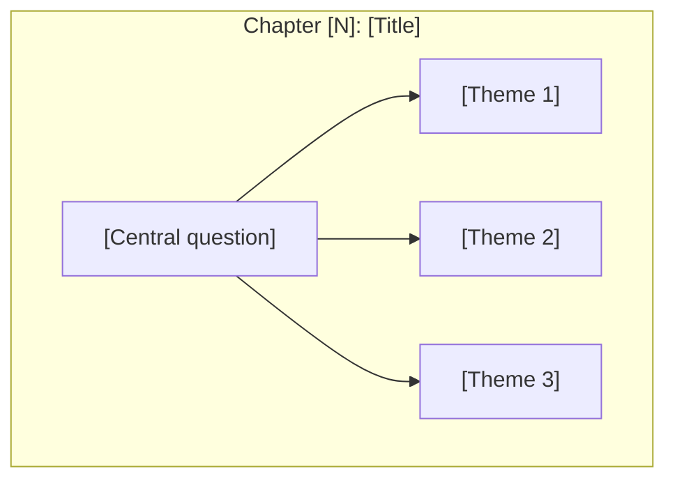
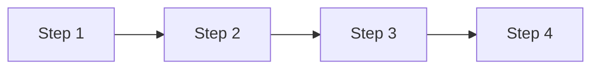

# Skill: Book to Dual-Reader Learning Companion

## Overview

This skill transforms a book into a **dual-reader companion website** featuring three reading modes:

1. **Read Original** — clean e-reader view of the original book text
2. **Read Companion** — interactive Starlight visual companion with diagrams, concept maps, and learning paths
3. **Read Side-by-Side** — split-pane reader: original text on left, visual companion on right

Additional features (inherited from visual companion):
- Custom designed landing page using frontend-design principles
- Chapter-by-chapter visual diagrams (Mermaid)
- Concept maps showing idea relationships
- Cross-linked concept pages
- Guided learning paths (Beginner/Intermediate/Advanced)
- Full-text search
- Dark mode support

## Prerequisites

- Node.js 18+
- Book content (PDF, EPUB, or text)
- Claude Code with file read permissions

### Version Pinning

This skill targets **Astro 5** with the standalone `render()` API. Key version requirements:

```json
{
  "astro": "^5.0.0",
  "@astrojs/starlight": "^0.32.0",
  "astro-mermaid": "^0.3.0"
}
```

> **Critical**: Astro 5 changed the content rendering API. Use `import { render } from 'astro:content'` and call `render(entry)`. Do NOT use the Astro 4 pattern `entry.render()` — it will fail with a `entry.render is not a function` error, especially for collections using the `glob` loader.

### Pre-flight Checks

Before starting, verify the environment:

```bash
# Check Node version (must be 18+)
node --version

# Check git identity (needed for commits/deploy)
git config user.name && git config user.email || echo "WARNING: git identity not set"

# Check disk space (Astro builds can use ~500MB for node_modules + dist)
df -h .
```

### Content Provenance

If the user provides a PDF/EPUB, extract text directly from it. If no source file is available, **clearly state** that content is synthesized from knowledge and may not match the original text word-for-word. Never present synthesized content as verbatim book text without disclosure.

## Architecture Decisions

| Decision | Choice | Rationale |
|----------|--------|-----------|
| Split-pane tech | Vanilla JS + CSS Grid | No React dependency; Astro renders content as HTML |
| Content storage | New `original` Astro content collection | Type-safe, queryable, cleanly separated from `docs` |
| URL routing | Path-based: `/read/original/[slug]`, `/read/side-by-side/[slug]` | Clean, bookmarkable, shareable |
| Navigation sync | URL-driven (both panels share chapter slug) | Simple, no client state management needed |
| Mobile fallback | Tab toggle below 768px | Side-by-side doesn't work on small screens |
| Skill approach | Standalone SKILL.md | Doesn't break simpler visual-companion skill |

## Directory Structure

```
src/
├── pages/
│   ├── index.astro                          # Landing page (3 reading modes)
│   └── read/
│       ├── original/[...slug].astro         # Original book reader
│       └── side-by-side/[...slug].astro     # Split-pane reader
├── content/
│   ├── docs/                                # Companion content (Starlight)
│   │   ├── overview.mdx
│   │   ├── chapters/
│   │   ├── concepts/
│   │   └── paths/
│   └── original/                            # Original book text
│       ├── 01-chapter-slug.md
│       ├── 02-chapter-slug.md
│       └── ...
├── layouts/
│   └── ReaderLayout.astro                   # Shared layout for reader pages
├── components/
│   ├── ReadingModeToggle.astro              # Mode switcher component
│   └── ChapterNav.astro                     # Chapter navigation component
└── styles/
    ├── custom.css                           # Starlight theme customization
    └── reader.css                           # Reader & split-pane styles
```

---

## Workflow

### Phase 1: Book Analysis (MODIFIED)

**Step 1.1: Extract Book Structure**

```
When given a book PDF or text:

1. IDENTIFY the book's structure:
   - Title and author
   - Number of chapters/parts
   - Chapter titles
   - Section/essay breakdown within chapters

2. CREATE a structure map:
   ```
   Book: [Title]
   Author: [Author]
   Parts: [Number]
   Chapters: [Number]

   Structure:
   - Part I: [Name]
     - Chapter 1: [Title]
       - 1.1 [Essay/Section]
       - 1.2 [Essay/Section]
     - Chapter 2: [Title]
   ...
   ```

3. IDENTIFY key concepts:
   - Central thesis/main idea
   - Key terms introduced
   - Recurring themes
   - Relationships between concepts

4. EXTRACT visual identity:
   - Core metaphors or symbols from the book
   - Suggested color palette based on book themes
   - Key iconography (e.g., Triad for Antifragile)

5. EXTRACT original text chapter-by-chapter (NEW):
   - Read through the entire book
   - Segment text by chapter boundaries
   - Preserve headings, paragraphs, blockquotes, emphasis
   - Note page numbers or section markers for reference
   - Store raw chapter text for Phase 5
```

**Step 1.1b: Genre Classification**

Classify the book into one PRIMARY genre using these signals:

| Genre | Signals |
|-------|---------|
| **TECHNICAL** | Code samples, architecture diagrams, API references, system design, algorithms, data models |
| **BUSINESS** | Frameworks, case studies, competitive analysis, market data, strategy models, org design |
| **NARRATIVE** | Chronological events, historical figures, cause-effect storytelling, scientific discoveries |
| **PHILOSOPHICAL** | Abstract arguments, thought experiments, conceptual distinctions, dialectical structure |

If the book spans genres, assign a SECONDARY genre. Tag each chapter as PRIMARY or SECONDARY during the structure map. Book-level pages (overview, concept pages) always use the PRIMARY genre.

**Step 1.1c: Load Visualization Sub-Skill**

Based on the genre classification, load the corresponding visualization sub-skill:
- TECHNICAL → `viz-technical` sub-skill
- BUSINESS → `viz-business` sub-skill
- NARRATIVE → `viz-narrative` sub-skill
- PHILOSOPHICAL → `viz-philosophical` sub-skill

If a SECONDARY genre was assigned, also load its sub-skill for chapters tagged with that genre. Use the PRIMARY genre's sub-skill for all book-level pages and the default color palette.

**Step 1.2: Concept Extraction**

```
For each chapter, identify:

1. CORE INSIGHT: The main idea in 1-2 sentences
2. KEY CONCEPTS: Terms or ideas introduced
3. RELATIONSHIPS: How concepts connect to:
   - Previous chapters
   - Other concepts in same chapter
   - Overall book thesis
4. VISUAL POTENTIAL: Use the Chapter Analysis Template from the loaded
   visualization sub-skill (Section C) to assess this chapter's visual content.
   Answer all questions in the template for this chapter.
5. ICONIC QUOTE: A memorable quote that captures the chapter essence
6. SLUG MAPPING (NEW): Assign a consistent slug per chapter
   that will be shared between original/ and docs/chapters/ collections.
   Format: NN-chapter-slug (e.g., 01-the-beginning, 02-core-ideas)
```

---

### Phase 2: Project Setup (MODIFIED)

**Step 2.1: Initialize Astro/Starlight Project**

```bash
# Create project directory
mkdir [book-slug]-dual
cd [book-slug]-dual

# Initialize Astro with Starlight
# NOTE: npm create can timeout in automated environments.
# If it hangs, use --skip-houston and run npm install separately.
npm create astro@latest . -- --template starlight --yes --no-git --skip-houston

# Install dependencies (run separately if npm create didn't complete install)
npm install

# Add Mermaid support
npm install astro-mermaid mermaid
```

> **Environment note**: In WSL2 or CI environments, `npm create` may timeout during dependency installation. If this happens, the project directory will exist but `node_modules/` will be empty. Simply run `npm install` manually to recover.

**Step 2.2: Configure Project**

Create `astro.config.mjs`:

```javascript
// @ts-check
import { defineConfig } from 'astro/config';
import starlight from '@astrojs/starlight';
import mermaid from 'astro-mermaid';

export default defineConfig({
  integrations: [
    // Mermaid MUST come before Starlight
    mermaid(),
    starlight({
      title: '[Book Title] Visual',
      description: 'A dual-reader learning companion for [Book Title]',
      customCss: ['./src/styles/custom.css'],
      sidebar: [
        { label: 'Book Overview', slug: 'overview' },
        {
          label: 'Chapters',
          autogenerate: { directory: 'chapters' },
        },
        {
          label: 'Core Concepts',
          autogenerate: { directory: 'concepts' },
        },
        {
          label: 'Learning Paths',
          autogenerate: { directory: 'paths' },
        },
      ],
    }),
  ],
});
```

**Step 2.3: Configure Content Collections**

Create or update `src/content.config.ts`:

```typescript
import { defineCollection, z } from 'astro:content';
import { docsLoader } from '@astrojs/starlight/loaders';
import { docsSchema } from '@astrojs/starlight/schema';
import { glob } from 'astro/loaders';

export const collections = {
  // Starlight companion content (diagrams, concepts, paths)
  docs: defineCollection({ loader: docsLoader(), schema: docsSchema() }),

  // Original book text (one file per chapter)
  original: defineCollection({
    loader: glob({ pattern: '**/*.md', base: './src/content/original' }),
    schema: z.object({
      title: z.string(),
      chapter: z.number(),
      slug: z.string(),  // matches companion chapter slug
    }),
  }),
};
```

**Step 2.4: Create Directory Structure**

```bash
# Create all required directories
mkdir -p src/pages/read/original
mkdir -p src/pages/read/side-by-side
mkdir -p src/content/docs/chapters
mkdir -p src/content/docs/concepts
mkdir -p src/content/docs/paths
mkdir -p src/content/original
mkdir -p src/layouts
mkdir -p src/components
mkdir -p src/styles
```

**Step 2.5: Incremental Build Checkpoint #1**

After creating the project scaffold AND before generating any content, run the first build:

```bash
npm run build
```

This validates:
- Astro and Starlight are properly installed
- The `original` content collection is recognized
- The `content.config.ts` compiles without errors

If this fails, fix it now. Do NOT proceed to content generation with a broken scaffold.

---

### Incremental Build Strategy

> **Lesson learned**: Do not wait until Phase 9 to build. Build incrementally:
>
> | Checkpoint | When | What it validates |
> |------------|------|-------------------|
> | **#1** | After Phase 2 (scaffold) | Project compiles, collections configured |
> | **#2** | After Phase 5 + 6 (1 chapter + reader) | `render()` API works, routing works |
> | **#3** | After all content generated | Full build, no broken links |
>
> This catches API mismatches (like Astro 4 vs 5 `render()`) at checkpoint #2 instead of after generating 30+ files.

---

### Phase 3: Landing Page Design (MODIFIED — 3 Reading Modes)

**Step 3.1: Invoke Frontend Design Skill**

For the landing page, ALWAYS use the frontend-design skill with this prompt pattern:

```
Create a visually striking landing page for the [Book Title] Dual Companion website -
a learning companion for [Author]'s book "[Full Book Title]".

The page should have:
1) Hero section with compelling visual design representing [KEY VISUAL METAPHOR FROM BOOK]
2) Key quote from the book: "[ICONIC QUOTE]"
3) Author attribution
4) "Choose Your Reading Experience" section with 3 mode cards:
   - "Read Original" — clean e-reader view of the book text
   - "Read Companion" — interactive visual companion with diagrams
   - "Read Side-by-Side" — original text + companion side by side
5) Visual representation of the journey through [N] parts/books
6) Core concepts grid with symbolic icons
7) Learning paths section (Beginner/Intermediate/Advanced)
8) Call-to-action to enter the learning experience

Use the color palette:
- Primary concept: #[color] ([description])
- Secondary concept: #[color] ([description])
- Tertiary concept: #[color] ([description])

Make it feel premium, philosophical, and intellectually engaging.
```

**Step 3.2: Landing Page Template Structure**

Create `src/pages/index.astro` with this structure:

```astro
---
// Custom landing page for [Book Title] Dual Companion
---
<!DOCTYPE html>
<html lang="en">
<head>
  <meta charset="UTF-8" />
  <meta name="viewport" content="width=device-width, initial-scale=1.0" />
  <title>[Book Title] Dual Companion</title>
  <meta name="description" content="Dual-reader learning companion for [Book Title] by [Author]" />

  <!-- Premium Typography -->
  <link rel="preconnect" href="https://fonts.googleapis.com" />
  <link rel="preconnect" href="https://fonts.gstatic.com" crossorigin />
  <link href="https://fonts.googleapis.com/css2?family=Cormorant+Garamond:ital,wght@0,400;0,600;1,400&family=Instrument+Sans:wght@400;500;600&family=JetBrains+Mono:wght@400&display=swap" rel="stylesheet" />

  <style>
    /* CSS Variables for theming */
    :root {
      --bg-dark: #0a0a0b;
      --bg-section: #111113;
      --bg-card: rgba(255,255,255,0.02);
      --text-primary: #f5f5f5;
      --text-secondary: #a0a0a0;
      --text-muted: #666;

      /* Book-specific colors - customize per book */
      --concept-primary: #c8e6c9;
      --concept-secondary: #fff9c4;
      --concept-tertiary: #ffcdd2;
      --accent: #4a9f4d;

      --font-display: 'Cormorant Garamond', Georgia, serif;
      --font-body: 'Instrument Sans', system-ui, sans-serif;
      --font-mono: 'JetBrains Mono', monospace;
    }

    * { margin: 0; padding: 0; box-sizing: border-box; }

    body {
      font-family: var(--font-body);
      background: var(--bg-dark);
      color: var(--text-primary);
      line-height: 1.6;
    }

    /* Hero Section */
    .hero {
      min-height: 100vh;
      display: flex;
      flex-direction: column;
      align-items: center;
      justify-content: center;
      padding: 4rem 2rem;
      text-align: center;
      position: relative;
      overflow: hidden;
    }

    .visual-metaphor {
      display: flex;
      align-items: center;
      justify-content: center;
      gap: 2rem;
      margin-bottom: 3rem;
    }

    .hero h1 {
      font-family: var(--font-display);
      font-size: clamp(3rem, 10vw, 6rem);
      font-weight: 400;
      font-style: italic;
      letter-spacing: -0.02em;
      margin-bottom: 0.5rem;
    }

    .subtitle {
      font-family: var(--font-mono);
      font-size: 0.875rem;
      letter-spacing: 0.3em;
      text-transform: uppercase;
      color: var(--text-muted);
      margin-bottom: 3rem;
    }

    .quote-section {
      max-width: 700px;
      margin-bottom: 3rem;
    }

    .quote {
      font-family: var(--font-display);
      font-size: 1.5rem;
      font-style: italic;
      color: var(--text-secondary);
      line-height: 1.8;
      margin-bottom: 1.5rem;
    }

    .author-name {
      font-family: var(--font-body);
      font-weight: 500;
      color: var(--text-primary);
    }

    .book-title-attr {
      font-size: 0.875rem;
      color: var(--text-muted);
    }

    /* Reading Mode Cards (NEW) */
    .reading-modes {
      padding: 6rem 2rem;
    }

    .reading-modes-grid {
      display: grid;
      grid-template-columns: repeat(auto-fit, minmax(300px, 1fr));
      gap: 1.5rem;
      max-width: 1100px;
      margin: 0 auto;
    }

    .mode-card {
      background: var(--bg-card);
      border: 1px solid rgba(255,255,255,0.08);
      border-radius: 12px;
      padding: 2.5rem 2rem;
      text-decoration: none;
      color: inherit;
      transition: all 0.3s ease;
      position: relative;
      overflow: hidden;
    }

    .mode-card:hover {
      border-color: var(--accent);
      transform: translateY(-4px);
      box-shadow: 0 12px 40px rgba(0,0,0,0.4);
    }

    .mode-card::before {
      content: '';
      position: absolute;
      top: 0;
      left: 0;
      right: 0;
      height: 3px;
    }

    .mode-card.mode-original::before { background: var(--concept-primary); }
    .mode-card.mode-companion::before { background: var(--concept-secondary); }
    .mode-card.mode-sidebyside::before { background: var(--concept-tertiary); }

    .mode-icon {
      font-size: 2rem;
      margin-bottom: 1rem;
    }

    .mode-label {
      font-family: var(--font-mono);
      font-size: 0.7rem;
      letter-spacing: 0.15em;
      text-transform: uppercase;
      color: var(--accent);
      margin-bottom: 0.75rem;
    }

    .mode-title {
      font-family: var(--font-display);
      font-size: 1.75rem;
      margin-bottom: 0.75rem;
    }

    .mode-desc {
      font-size: 0.9rem;
      color: var(--text-secondary);
      line-height: 1.7;
    }

    /* CTA Buttons */
    .cta-group {
      display: flex;
      gap: 1rem;
      flex-wrap: wrap;
      justify-content: center;
    }

    .btn-primary {
      background: var(--accent);
      color: white;
      padding: 1rem 2rem;
      border-radius: 4px;
      text-decoration: none;
      font-weight: 500;
      transition: transform 0.2s, box-shadow 0.2s;
    }

    .btn-primary:hover {
      transform: translateY(-2px);
      box-shadow: 0 4px 20px rgba(74, 159, 77, 0.3);
    }

    .btn-secondary {
      background: transparent;
      color: var(--text-primary);
      padding: 1rem 2rem;
      border: 1px solid var(--text-muted);
      border-radius: 4px;
      text-decoration: none;
      font-weight: 500;
      transition: border-color 0.2s;
    }

    .btn-secondary:hover {
      border-color: var(--text-primary);
    }

    /* Sections */
    section { padding: 6rem 2rem; }
    .section-dark { background: var(--bg-section); }

    .section-title {
      font-family: var(--font-display);
      font-size: 2.5rem;
      font-style: italic;
      text-align: center;
      margin-bottom: 1rem;
    }

    .section-subtitle {
      text-align: center;
      color: var(--text-secondary);
      max-width: 600px;
      margin: 0 auto 3rem;
    }

    /* Parts/Books Grid */
    .parts-grid {
      display: grid;
      grid-template-columns: repeat(auto-fit, minmax(280px, 1fr));
      gap: 1.5rem;
      max-width: 1200px;
      margin: 0 auto;
    }

    .part-card {
      background: var(--bg-card);
      border: 1px solid rgba(255,255,255,0.05);
      border-left: 3px solid var(--concept-primary);
      padding: 1.5rem;
      text-decoration: none;
      color: inherit;
      transition: background 0.2s, transform 0.2s;
    }

    .part-card:hover {
      background: rgba(255,255,255,0.05);
      transform: translateX(4px);
    }

    .part-number {
      font-family: var(--font-display);
      font-size: 3rem;
      color: rgba(255,255,255,0.1);
      float: right;
    }

    .part-title {
      font-family: var(--font-display);
      font-size: 1.25rem;
      margin-bottom: 0.5rem;
    }

    .part-chapters {
      font-family: var(--font-mono);
      font-size: 0.75rem;
      color: var(--concept-primary);
      margin-bottom: 0.5rem;
    }

    .part-desc {
      font-size: 0.9rem;
      color: var(--text-secondary);
    }

    /* Concepts Grid */
    .concepts-grid {
      display: grid;
      grid-template-columns: repeat(auto-fit, minmax(200px, 1fr));
      gap: 1px;
      background: rgba(255,255,255,0.05);
      border: 1px solid rgba(255,255,255,0.05);
      border-radius: 8px;
      overflow: hidden;
      max-width: 900px;
      margin: 0 auto;
    }

    .concept-card {
      background: var(--bg-dark);
      padding: 2rem 1.5rem;
      text-align: center;
      text-decoration: none;
      color: inherit;
      transition: background 0.2s;
    }

    .concept-card:hover { background: rgba(255,255,255,0.05); }

    .concept-icon {
      font-size: 1.5rem;
      margin-bottom: 0.75rem;
      color: var(--concept-primary);
    }

    .concept-name {
      font-family: var(--font-display);
      font-size: 1.1rem;
      margin-bottom: 0.5rem;
    }

    .concept-brief {
      font-size: 0.8rem;
      color: var(--text-secondary);
    }

    /* Learning Paths */
    .paths-grid {
      display: grid;
      grid-template-columns: repeat(auto-fit, minmax(280px, 1fr));
      gap: 1.5rem;
      max-width: 1000px;
      margin: 0 auto;
    }

    .path-card {
      background: var(--bg-dark);
      border: 1px solid rgba(255,255,255,0.1);
      border-radius: 8px;
      padding: 2rem;
      text-decoration: none;
      color: inherit;
      transition: border-color 0.2s;
    }

    .path-card:hover { border-color: var(--concept-primary); }

    .path-level {
      display: inline-block;
      font-size: 0.75rem;
      padding: 0.25rem 0.75rem;
      border-radius: 100px;
      background: rgba(200, 230, 201, 0.1);
      color: var(--concept-primary);
      margin-bottom: 1rem;
    }

    .path-title {
      font-family: var(--font-display);
      font-size: 1.5rem;
      margin-bottom: 0.75rem;
    }

    .path-desc {
      font-size: 0.9rem;
      color: var(--text-secondary);
      margin-bottom: 1rem;
    }

    .path-meta {
      font-family: var(--font-mono);
      font-size: 0.75rem;
      color: var(--text-muted);
    }

    /* Final CTA */
    .final-cta {
      text-align: center;
      padding: 6rem 2rem;
    }

    .final-cta h2 {
      font-family: var(--font-display);
      font-size: 2.5rem;
      font-style: italic;
      margin-bottom: 1rem;
    }

    .final-cta p {
      color: var(--text-secondary);
      margin-bottom: 2rem;
    }

    /* Footer */
    footer {
      text-align: center;
      padding: 2rem;
      color: var(--text-muted);
      font-size: 0.875rem;
      border-top: 1px solid rgba(255,255,255,0.05);
    }

    footer a { color: var(--text-secondary); }

    /* Scroll Animation */
    .fade-in {
      opacity: 0;
      transform: translateY(20px);
      transition: opacity 0.6s ease, transform 0.6s ease;
    }

    .fade-in.visible {
      opacity: 1;
      transform: translateY(0);
    }
  </style>
</head>
<body>
  <!-- HERO SECTION -->
  <section class="hero">
    <div class="visual-metaphor">
      <!-- Book-specific visual metaphor goes here -->
    </div>

    <div class="title-group">
      <h1>[Book Title]</h1>
      <p class="subtitle">Dual Learning Companion</p>
    </div>

    <div class="quote-section">
      <blockquote class="quote">
        "[Iconic quote from the book]"
      </blockquote>
      <div class="attribution">
        <span class="author-name">[Author Name]</span>
        <p class="book-title-attr">Author of [Full Book Title]</p>
      </div>
    </div>

    <div class="cta-group">
      <a href="/read/side-by-side/01-[first-chapter-slug]/" class="btn-primary">Read Side-by-Side</a>
      <a href="/overview/" class="btn-secondary">Explore Companion</a>
    </div>
  </section>

  <!-- READING MODE SELECTION (NEW) -->
  <section class="reading-modes section-dark">
    <h2 class="section-title">Choose Your Reading Experience</h2>
    <p class="section-subtitle">
      Three ways to engage with [Book Title] — read at your own pace.
    </p>
    <div class="reading-modes-grid">
      <a href="/read/original/01-[first-chapter-slug]/" class="mode-card mode-original fade-in">
        <div class="mode-icon">&#x1f4d6;</div>
        <p class="mode-label">Mode 1</p>
        <h3 class="mode-title">Read Original</h3>
        <p class="mode-desc">
          A clean, focused e-reader experience. Read [Author]'s original text
          with comfortable typography and distraction-free navigation.
        </p>
      </a>
      <a href="/overview/" class="mode-card mode-companion fade-in">
        <div class="mode-icon">&#x1f4ca;</div>
        <p class="mode-label">Mode 2</p>
        <h3 class="mode-title">Read Companion</h3>
        <p class="mode-desc">
          Visual learning companion with Mermaid diagrams, concept maps,
          cross-linked ideas, and guided learning paths.
        </p>
      </a>
      <a href="/read/side-by-side/01-[first-chapter-slug]/" class="mode-card mode-sidebyside fade-in">
        <div class="mode-icon">&#x1f4d1;</div>
        <p class="mode-label">Mode 3</p>
        <h3 class="mode-title">Read Side-by-Side</h3>
        <p class="mode-desc">
          Original text and visual companion in a split-pane view.
          Follow along with diagrams as you read each chapter.
        </p>
      </a>
    </div>
  </section>

  <!-- PARTS/BOOKS JOURNEY -->
  <section>
    <h2 class="section-title">The Journey Through [N] [Parts/Books]</h2>
    <p class="section-subtitle">
      Navigate through [N] chapters exploring [brief description].
    </p>
    <div class="parts-grid">
      <a href="/chapters/01-[slug]/overview/" class="part-card fade-in">
        <span class="part-number">I</span>
        <h3 class="part-title">[Part Title]</h3>
        <p class="part-chapters">Chapters 1-4</p>
        <p class="part-desc">[Brief description]</p>
      </a>
      <!-- More part cards... -->
    </div>
  </section>

  <!-- CORE CONCEPTS -->
  <section class="section-dark">
    <h2 class="section-title">Core Concepts</h2>
    <p class="section-subtitle">
      Master the fundamental ideas that form the foundation of [book's philosophy].
    </p>
    <div class="concepts-grid">
      <a href="/concepts/[concept-slug]/" class="concept-card fade-in">
        <div class="concept-icon">[Symbol]</div>
        <h4 class="concept-name">[Concept Name]</h4>
        <p class="concept-brief">[One-line description]</p>
      </a>
      <!-- More concept cards... -->
    </div>
  </section>

  <!-- LEARNING PATHS -->
  <section>
    <h2 class="section-title">Choose Your Path</h2>
    <p class="section-subtitle">
      Structured learning journeys from foundational concepts to advanced application.
    </p>
    <div class="paths-grid">
      <a href="/paths/[intro-path]/" class="path-card fade-in">
        <span class="path-level">Beginner</span>
        <h3 class="path-title">[Path Name]</h3>
        <p class="path-desc">[Description]</p>
        <p class="path-meta">[Parts covered] &middot; [N] Chapters</p>
      </a>
      <a href="/paths/[intermediate-path]/" class="path-card fade-in">
        <span class="path-level">Intermediate</span>
        <h3 class="path-title">[Path Name]</h3>
        <p class="path-desc">[Description]</p>
        <p class="path-meta">[Parts covered] &middot; [N] Chapters</p>
      </a>
      <a href="/paths/[advanced-path]/" class="path-card fade-in">
        <span class="path-level">Advanced</span>
        <h3 class="path-title">[Path Name]</h3>
        <p class="path-desc">[Description]</p>
        <p class="path-meta">[Parts covered] &middot; [N] Chapters</p>
      </a>
    </div>
  </section>

  <!-- FINAL CTA -->
  <section class="final-cta">
    <h2>Ready to [Action verb related to book]?</h2>
    <p>Transform how you think about [book's subject matter].</p>
    <a href="/read/side-by-side/01-[first-chapter-slug]/" class="btn-primary">Start Reading Now</a>
  </section>

  <!-- FOOTER -->
  <footer>
    <p>A dual learning companion for <a href="[Amazon/book link]">[Full Book Title]</a> by [Author]</p>
  </footer>

  <!-- Scroll Animation Script -->
  <script>
    document.addEventListener('DOMContentLoaded', () => {
      const observer = new IntersectionObserver((entries) => {
        entries.forEach(entry => {
          if (entry.isIntersecting) {
            entry.target.classList.add('visible');
          }
        });
      }, { threshold: 0.1 });

      document.querySelectorAll('.fade-in').forEach(el => observer.observe(el));
    });
  </script>
</body>
</html>
```

**Step 3.3: Visual Metaphor Examples**

Each book should have a unique visual metaphor in the hero section:

| Book | Visual Metaphor | Implementation |
|------|-----------------|----------------|
| Antifragile | The Triad (Star/Square/Triangle) | CSS clip-path shapes with floating animation |
| Thinking Fast & Slow | Two Systems (1 & 2) | Animated numbers or brain hemispheres |
| Black Swan | Swan silhouette | SVG with gradient |
| Atomic Habits | Compound curve | SVG path animation |
| Zero to One | 0 → 1 transition | Number morph animation |

---

### Phase 4: Companion Content Generation (UNCHANGED)

**Step 4.1: Book Overview Page**

Create `src/content/docs/overview.mdx` (replaces index.mdx):

```markdown
---
title: Book Overview
description: 'Complete overview of [Book Title] by [Author]'
---

import { Card, CardGrid } from '@astrojs/starlight/components';

## The Central Idea: [Core Concept]

[2-3 paragraphs explaining the book's main thesis]

```mermaid
flowchart LR
    [Main concept diagram showing book's central framework]
```

> "[Key quote from book]"
> <cite>— [Author]</cite>

---

## Book Structure

<CardGrid>
  <Card title="[Part I Title]" icon="rocket">
    **Chapters 1-N**: [Brief description]

    [Start Part I →](/chapters/01-[slug]/overview/)
  </Card>
  <!-- More cards for each part -->
</CardGrid>

---

## Core Concepts

```mermaid
mindmap
  root(([Central Concept]))
    [Branch 1]
    [Branch 2]
    [Branch 3]
```

<CardGrid>
  <Card title="[Concept]" icon="[icon]">
    [Brief description]

    [Learn more →](/concepts/[slug]/)
  </Card>
  <!-- More concept cards -->
</CardGrid>

---

## Learning Paths

<CardGrid>
  <Card title="[Path Name]" icon="rocket">
    **[Parts covered]** | [Audience]

    [Description]

    [Begin Path →](/paths/[slug]/)
  </Card>
  <!-- More path cards -->
</CardGrid>

---

## Key Comparisons

| Aspect | [Category 1] | [Category 2] | [Category 3] |
|--------|--------------|--------------|--------------|
| **[Row 1]** | [Value] | [Value] | [Value] |
| **[Row 2]** | [Value] | [Value] | [Value] |

---

## About This Companion

This dual learning companion transforms *[Book Title]* into an interactive experience using:

- **Original Text Reader**: Read the book in a clean e-reader format
- **Side-by-Side Mode**: Follow diagrams alongside the original text
- **Mermaid Diagrams**: Flowcharts, mindmaps, and concept maps
- **Progressive Learning**: Three guided paths from foundational to advanced
- **Cross-References**: Concepts linked across all chapters
```

**Step 4.2: Chapter Overview Template**

```markdown
---
title: "Chapter [N]: [Title]"
description: "[Brief description]"
---

# Chapter [N]: [Title]

[1-2 paragraph introduction to chapter themes]

## Chapter Overview



## Sections in This Chapter

| Section | Title | Key Idea |
|---------|-------|----------|
| [N.1](/chapters/[slug]/[section]/) | [Title] | [One-line summary] |
| [N.2](/chapters/[slug]/[section]/) | [Title] | [One-line summary] |

## Key Themes

- **[Theme 1]** — [Brief explanation]
- **[Theme 2]** — [Brief explanation]

## Related Concepts

- [Concept 1](/concepts/[slug]/)
- [Concept 2](/concepts/[slug]/)

## Read This Chapter

- [Read Original Text →](/read/original/[chapter-slug]/)
- [Read Side-by-Side →](/read/side-by-side/[chapter-slug]/)
```

**Step 4.3: Concept Page Template**

```markdown
---
title: "[Concept Name]"
description: "Cross-chapter exploration of [concept]"
---

# [Concept Name]

[Definition and importance in 2-3 sentences]

## Concept Overview

```mermaid
mindmap
  root(([Concept]))
    [Branch 1]
      [Detail]
    [Branch 2]
      [Detail]
    [Branch 3]
      [Detail]
```

## [Main explanation sections]

## Where This Appears in the Book

| Chapter | Context | Key Insight |
|---------|---------|-------------|
| [Ch N](/chapters/...) | [Context] | [Insight] |

## Related Concepts

- [Concept 1](/concepts/[slug]/)
- [Concept 2](/concepts/[slug]/)
```

**Step 4.4: Learning Path Template**

```markdown
---
title: "Learning Path: [Name]"
description: "A guided journey through [topic]"
---

# Learning Path: [Name]

[Description of what this path covers and who it's for]

## Path Overview



---

## Step 1: [Title]

**Goal:** [What the reader will understand]

### Read
- [Link to content]

### Key Diagram

```mermaid
[Relevant diagram]
```

### Check Your Understanding
- [ ] [Question 1]
- [ ] [Question 2]

---

[Repeat for each step]

---

## Path Complete!

You now understand:
- [Learning outcome 1]
- [Learning outcome 2]

**Continue with:** [Next recommended content]
```

---

### Phase 5: Original Content Generation (NEW)

**Step 5.1: Extract Chapter Text**

For each chapter identified in Phase 1:

1. Read the book text for that chapter from the PDF/EPUB
2. Convert to clean markdown preserving:
   - Chapter title as H1
   - Section headings as H2/H3
   - Paragraphs with proper spacing
   - Blockquotes for quoted material
   - Emphasis (bold/italic) where present
   - Lists where applicable
3. Do NOT include diagrams, concept maps, or visual companion content — that belongs in `docs/`

**Step 5.2: Original Chapter File Template**

Create one file per chapter in `src/content/original/`:

File: `src/content/original/NN-chapter-slug.md`

```markdown
---
title: "Chapter [N]: [Title]"
chapter: [N]
slug: "NN-chapter-slug"
---

# [Chapter Title]

[Full original text of the chapter, cleaned and formatted as markdown]

[Paragraphs, blockquotes, emphasis, and lists preserved from the source]

[Section headings preserved as ## or ### headings]
```

**Step 5.3: Slug Consistency Rules**

The slug in each original chapter's frontmatter MUST match the corresponding companion chapter directory name:

```
src/content/original/01-the-triad.md        → slug: "01-the-triad"
src/content/docs/chapters/01-the-triad/     → companion chapter
```

This allows the reader pages to fetch matching content from both collections using the same slug parameter.

**Step 5.4: Text Extraction Guidelines**

When extracting text from the book:

- **Preserve the author's voice**: Do not paraphrase or summarize. Use the actual text.
- **Clean OCR artifacts**: Fix obvious scanning errors (broken words, garbled characters)
- **Normalize formatting**: Consistent heading levels, paragraph breaks, quote formatting
- **Omit non-text elements**: Figures, tables-of-contents, indexes, and footnote references that don't render well in markdown
- **Preserve footnotes inline**: Convert footnotes to inline parenthetical notes or markdown footnote syntax
- **Chapter boundaries**: Each file contains exactly one chapter — no partial chapters, no multiple chapters

---

### Phase 6: Reader Components (NEW)

**Step 6.1: Reader Layout**

Create `src/layouts/ReaderLayout.astro`:

```astro
---
interface Props {
  title: string;
  bookTitle: string;
  chapterSlug: string;
  mode: 'original' | 'companion' | 'side-by-side';
  prevChapter?: { slug: string; title: string } | null;
  nextChapter?: { slug: string; title: string } | null;
  allChapters: Array<{ slug: string; title: string; chapter: number }>;
}

const { title, bookTitle, chapterSlug, mode, prevChapter, nextChapter, allChapters } = Astro.props;

import '../styles/reader.css';
---

<!DOCTYPE html>
<html lang="en">
<head>
  <meta charset="UTF-8" />
  <meta name="viewport" content="width=device-width, initial-scale=1.0" />
  <title>{title} — {bookTitle}</title>

  <link rel="preconnect" href="https://fonts.googleapis.com" />
  <link rel="preconnect" href="https://fonts.gstatic.com" crossorigin />
  <link href="https://fonts.googleapis.com/css2?family=Cormorant+Garamond:ital,wght@0,400;0,600;1,400&family=Instrument+Sans:wght@400;500;600&family=JetBrains+Mono:wght@400&display=swap" rel="stylesheet" />
</head>
<body class={`reader-body mode-${mode}`}>
  <!-- Top Bar -->
  <header class="reader-topbar">
    <div class="topbar-left">
      <a href="/" class="topbar-home" aria-label="Home">&larr; Home</a>
      <span class="topbar-book-title">{bookTitle}</span>
    </div>
    <div class="topbar-center">
      <h1 class="topbar-chapter-title">{title}</h1>
    </div>
    <div class="topbar-right">
      <!-- Reading Mode Toggle -->
      <nav class="mode-toggle" aria-label="Reading mode">
        <a
          href={`/read/original/${chapterSlug}/`}
          class:list={['mode-toggle-btn', { active: mode === 'original' }]}
        >Original</a>
        <a
          href={`/chapters/${chapterSlug}/overview/`}
          class:list={['mode-toggle-btn', { active: mode === 'companion' }]}
        >Companion</a>
        <a
          href={`/read/side-by-side/${chapterSlug}/`}
          class:list={['mode-toggle-btn', { active: mode === 'side-by-side' }]}
        >Side-by-Side</a>
      </nav>
    </div>
  </header>

  <!-- Chapter Navigation Drawer -->
  <aside class="chapter-nav" id="chapterNav">
    <button class="chapter-nav-toggle" id="chapterNavToggle" aria-label="Toggle chapter list">
      Chapters
    </button>
    <ul class="chapter-list" id="chapterList">
      {allChapters.map(ch => (
        <li class:list={['chapter-item', { active: ch.slug === chapterSlug }]}>
          <a href={
            mode === 'original' ? `/read/original/${ch.slug}/`
            : mode === 'side-by-side' ? `/read/side-by-side/${ch.slug}/`
            : `/chapters/${ch.slug}/overview/`
          }>
            Ch. {ch.chapter}: {ch.title}
          </a>
        </li>
      ))}
    </ul>
  </aside>

  <!-- Main Content Slot -->
  <main class="reader-main">
    <slot />
  </main>

  <!-- Chapter Prev/Next Navigation -->
  <footer class="reader-footer">
    <nav class="chapter-pager">
      {prevChapter ? (
        <a
          href={
            mode === 'original' ? `/read/original/${prevChapter.slug}/`
            : mode === 'side-by-side' ? `/read/side-by-side/${prevChapter.slug}/`
            : `/chapters/${prevChapter.slug}/overview/`
          }
          class="pager-link pager-prev"
        >
          &larr; {prevChapter.title}
        </a>
      ) : <span />}
      {nextChapter ? (
        <a
          href={
            mode === 'original' ? `/read/original/${nextChapter.slug}/`
            : mode === 'side-by-side' ? `/read/side-by-side/${nextChapter.slug}/`
            : `/chapters/${nextChapter.slug}/overview/`
          }
          class="pager-link pager-next"
        >
          {nextChapter.title} &rarr;
        </a>
      ) : <span />}
    </nav>
  </footer>

  <!-- Chapter nav toggle script -->
  <script>
    const toggle = document.getElementById('chapterNavToggle');
    const list = document.getElementById('chapterList');
    if (toggle && list) {
      toggle.addEventListener('click', () => {
        list.classList.toggle('open');
        toggle.classList.toggle('open');
      });
    }
  </script>
</body>
</html>
```

**Step 6.2: ReadingModeToggle Component**

Create `src/components/ReadingModeToggle.astro`:

```astro
---
interface Props {
  currentMode: 'original' | 'companion' | 'side-by-side';
  chapterSlug: string;
}

const { currentMode, chapterSlug } = Astro.props;

const modes = [
  { id: 'original', label: 'Original', href: `/read/original/${chapterSlug}/` },
  { id: 'companion', label: 'Companion', href: `/chapters/${chapterSlug}/overview/` },
  { id: 'side-by-side', label: 'Side-by-Side', href: `/read/side-by-side/${chapterSlug}/` },
];
---

<nav class="reading-mode-toggle" aria-label="Reading mode">
  {modes.map(mode => (
    <a
      href={mode.href}
      class:list={['rmt-btn', { active: mode.id === currentMode }]}
      aria-current={mode.id === currentMode ? 'page' : undefined}
    >
      {mode.label}
    </a>
  ))}
</nav>

<style>
  .reading-mode-toggle {
    display: inline-flex;
    gap: 2px;
    background: rgba(255,255,255,0.05);
    border-radius: 8px;
    padding: 3px;
  }

  .rmt-btn {
    padding: 0.4rem 1rem;
    border-radius: 6px;
    text-decoration: none;
    font-size: 0.8rem;
    font-weight: 500;
    color: #a0a0a0;
    transition: all 0.2s;
  }

  .rmt-btn:hover {
    color: #f5f5f5;
    background: rgba(255,255,255,0.05);
  }

  .rmt-btn.active {
    color: #f5f5f5;
    background: rgba(74, 159, 77, 0.2);
  }
</style>
```

**Step 6.3: ChapterNav Component**

Create `src/components/ChapterNav.astro`:

```astro
---
interface Props {
  chapters: Array<{ slug: string; title: string; chapter: number }>;
  currentSlug: string;
  mode: 'original' | 'companion' | 'side-by-side';
}

const { chapters, currentSlug, mode } = Astro.props;

function getChapterHref(slug: string) {
  switch (mode) {
    case 'original': return `/read/original/${slug}/`;
    case 'side-by-side': return `/read/side-by-side/${slug}/`;
    default: return `/chapters/${slug}/overview/`;
  }
}
---

<nav class="chapter-sidebar" aria-label="Chapter navigation">
  <h3 class="chapter-sidebar-title">Chapters</h3>
  <ol class="chapter-sidebar-list">
    {chapters
      .sort((a, b) => a.chapter - b.chapter)
      .map(ch => (
        <li class:list={['chapter-sidebar-item', { active: ch.slug === currentSlug }]}>
          <a href={getChapterHref(ch.slug)}>
            <span class="ch-num">{ch.chapter}</span>
            <span class="ch-title">{ch.title}</span>
          </a>
        </li>
      ))}
  </ol>
</nav>

<style>
  .chapter-sidebar {
    padding: 1rem;
  }

  .chapter-sidebar-title {
    font-family: 'JetBrains Mono', monospace;
    font-size: 0.7rem;
    letter-spacing: 0.15em;
    text-transform: uppercase;
    color: #666;
    margin-bottom: 0.75rem;
  }

  .chapter-sidebar-list {
    list-style: none;
    padding: 0;
    margin: 0;
  }

  .chapter-sidebar-item a {
    display: flex;
    align-items: baseline;
    gap: 0.5rem;
    padding: 0.4rem 0.5rem;
    border-radius: 4px;
    text-decoration: none;
    color: #a0a0a0;
    font-size: 0.85rem;
    transition: all 0.15s;
  }

  .chapter-sidebar-item a:hover {
    color: #f5f5f5;
    background: rgba(255,255,255,0.05);
  }

  .chapter-sidebar-item.active a {
    color: #f5f5f5;
    background: rgba(74, 159, 77, 0.15);
  }

  .ch-num {
    font-family: 'JetBrains Mono', monospace;
    font-size: 0.75rem;
    color: #666;
    min-width: 1.5rem;
  }
</style>
```

**Step 6.4: Original Reader Page**

Create `src/pages/read/original/[...slug].astro`:

```astro
---
// IMPORTANT: Use `render` from 'astro:content' (Astro 5 API).
// Do NOT call entry.render() — that is Astro 4 and will fail with glob loader.
import { getCollection, render } from 'astro:content';
import ReaderLayout from '../../../layouts/ReaderLayout.astro';

export async function getStaticPaths() {
  const chapters = await getCollection('original');
  const sorted = [...chapters].sort((a, b) => a.data.chapter - b.data.chapter);

  return sorted.map((entry, i) => ({
    params: { slug: entry.data.slug },
    props: {
      entry,
      prevChapter: i > 0
        ? { slug: sorted[i - 1].data.slug, title: sorted[i - 1].data.title, chapter: sorted[i - 1].data.chapter }
        : null,
      nextChapter: i < sorted.length - 1
        ? { slug: sorted[i + 1].data.slug, title: sorted[i + 1].data.title, chapter: sorted[i + 1].data.chapter }
        : null,
      allChapters: sorted.map(c => ({
        slug: c.data.slug, title: c.data.title, chapter: c.data.chapter,
      })),
    },
  }));
}

const { entry, prevChapter, nextChapter, allChapters } = Astro.props;
const { Content } = await render(entry);  // Astro 5: standalone render()
---

<ReaderLayout
  title={entry.data.title}
  bookTitle="[Book Title]"
  chapterSlug={entry.data.slug}
  mode="original"
  prevChapter={prevChapter}
  nextChapter={nextChapter}
  allChapters={sortedChapters}
>
  <article class="original-reader">
    <Content />
  </article>
</ReaderLayout>

<style>
  .original-reader {
    max-width: 65ch;
    margin: 0 auto;
    padding: 3rem 2rem 6rem;
    font-family: 'Cormorant Garamond', Georgia, serif;
    font-size: 1.2rem;
    line-height: 1.9;
    color: #e0e0e0;
  }

  .original-reader :global(h1) {
    font-size: 2.5rem;
    font-weight: 400;
    font-style: italic;
    margin-bottom: 2rem;
    color: #f5f5f5;
  }

  .original-reader :global(h2) {
    font-size: 1.75rem;
    font-weight: 600;
    margin-top: 3rem;
    margin-bottom: 1rem;
    color: #f5f5f5;
  }

  .original-reader :global(h3) {
    font-size: 1.3rem;
    font-weight: 600;
    margin-top: 2rem;
    margin-bottom: 0.75rem;
    color: #f5f5f5;
  }

  .original-reader :global(p) {
    margin-bottom: 1.25rem;
    text-indent: 1.5rem;
  }

  .original-reader :global(p:first-of-type) {
    text-indent: 0;
  }

  .original-reader :global(blockquote) {
    border-left: 3px solid rgba(74, 159, 77, 0.5);
    padding-left: 1.5rem;
    margin: 2rem 0;
    font-style: italic;
    color: #a0a0a0;
  }

  .original-reader :global(em) {
    font-style: italic;
  }

  .original-reader :global(strong) {
    font-weight: 600;
    color: #f5f5f5;
  }
</style>
```

**Step 6.5: Side-by-Side Reader Page**

Create `src/pages/read/side-by-side/[...slug].astro`:

```astro
---
// IMPORTANT: Use `render` from 'astro:content' (Astro 5 API).
// Do NOT call entry.render() — that is Astro 4 and will fail with glob loader.
import { getCollection, render } from 'astro:content';
import ReaderLayout from '../../../layouts/ReaderLayout.astro';

export async function getStaticPaths() {
  const chapters = await getCollection('original');
  const docs = await getCollection('docs');
  const sorted = [...chapters].sort((a, b) => a.data.chapter - b.data.chapter);

  return sorted.map((entry, i) => {
    const slug = entry.data.slug;
    // Find matching companion doc whose id starts with "chapters/<slug>"
    const companionDocs = docs.filter(d => d.id.startsWith(`chapters/${slug}`));
    const companionEntry =
      companionDocs.find(d => d.id.includes('overview')) ??
      companionDocs[0] ?? null;

    return {
      params: { slug },
      props: {
        entry,
        companionEntry,
        prevChapter: i > 0
          ? { slug: sorted[i - 1].data.slug, title: sorted[i - 1].data.title, chapter: sorted[i - 1].data.chapter }
          : null,
        nextChapter: i < sorted.length - 1
          ? { slug: sorted[i + 1].data.slug, title: sorted[i + 1].data.title, chapter: sorted[i + 1].data.chapter }
          : null,
        allChapters: sorted.map(c => ({
          slug: c.data.slug, title: c.data.title, chapter: c.data.chapter,
        })),
      },
    };
  });
}

const { entry, companionEntry, prevChapter, nextChapter, allChapters } = Astro.props;
const { Content: OriginalContent } = await render(entry);  // Astro 5: standalone render()
const CompanionContent = companionEntry ? (await render(companionEntry)).Content : null;
---

<ReaderLayout
  title={entry.data.title}
  bookTitle="[Book Title]"
  chapterSlug={entry.data.slug}
  mode="side-by-side"
  prevChapter={prevChapter}
  nextChapter={nextChapter}
  allChapters={sortedChapters}
>
  <!-- Mobile: Tab toggle -->
  <div class="mobile-tabs">
    <button class="mobile-tab active" data-panel="original">Original</button>
    <button class="mobile-tab" data-panel="companion">Companion</button>
  </div>

  <!-- Split-pane container -->
  <div class="split-reader">
    <div class="split-panel panel-original" id="panelOriginal">
      <article class="original-reader">
        <OriginalContent />
      </article>
    </div>

    <div class="divider" id="divider" role="separator" aria-label="Resize panels">
      <div class="divider-handle"></div>
    </div>

    <div class="split-panel panel-companion" id="panelCompanion">
      {CompanionContent ? (
        <article class="companion-reader">
          <CompanionContent />
        </article>
      ) : (
        <div class="companion-placeholder">
          <p>No companion content available for this chapter yet.</p>
          <a href={`/chapters/${entry.data.slug}/overview/`}>View companion overview &rarr;</a>
        </div>
      )}
    </div>
  </div>

  <!-- Draggable divider script -->
  <script>
    const divider = document.getElementById('divider');
    const container = document.querySelector('.split-reader');
    let isDragging = false;

    if (divider && container) {
      divider.addEventListener('mousedown', (e) => {
        isDragging = true;
        document.body.style.cursor = 'col-resize';
        document.body.style.userSelect = 'none';
        e.preventDefault();
      });

      document.addEventListener('mousemove', (e) => {
        if (!isDragging || !container) return;
        const rect = container.getBoundingClientRect();
        const pct = ((e.clientX - rect.left) / rect.width) * 100;
        const clamped = Math.max(20, Math.min(80, pct));
        (container as HTMLElement).style.gridTemplateColumns = `${clamped}% 4px ${100 - clamped}%`;
      });

      document.addEventListener('mouseup', () => {
        if (isDragging) {
          isDragging = false;
          document.body.style.cursor = '';
          document.body.style.userSelect = '';
        }
      });

      // Touch support for mobile/tablet
      divider.addEventListener('touchstart', (e) => {
        isDragging = true;
        e.preventDefault();
      });

      document.addEventListener('touchmove', (e) => {
        if (!isDragging || !container) return;
        const touch = e.touches[0];
        const rect = container.getBoundingClientRect();
        const pct = ((touch.clientX - rect.left) / rect.width) * 100;
        const clamped = Math.max(20, Math.min(80, pct));
        (container as HTMLElement).style.gridTemplateColumns = `${clamped}% 4px ${100 - clamped}%`;
      });

      document.addEventListener('touchend', () => {
        isDragging = false;
      });
    }

    // Mobile tab toggle
    const tabs = document.querySelectorAll('.mobile-tab');
    const originalPanel = document.getElementById('panelOriginal');
    const companionPanel = document.getElementById('panelCompanion');

    tabs.forEach(tab => {
      tab.addEventListener('click', () => {
        tabs.forEach(t => t.classList.remove('active'));
        tab.classList.add('active');

        const panel = (tab as HTMLElement).dataset.panel;
        if (panel === 'original') {
          originalPanel?.classList.add('mobile-active');
          companionPanel?.classList.remove('mobile-active');
        } else {
          companionPanel?.classList.add('mobile-active');
          originalPanel?.classList.remove('mobile-active');
        }
      });
    });

    // Initialize mobile state
    if (window.innerWidth < 768) {
      originalPanel?.classList.add('mobile-active');
    }
  </script>
</ReaderLayout>

<style>
  /* Split-pane layout */
  .split-reader {
    display: grid;
    grid-template-columns: 1fr 4px 1fr;
    height: calc(100vh - 60px - 50px); /* Subtract topbar + footer */
    overflow: hidden;
  }

  .split-panel {
    overflow-y: auto;
    padding: 2rem;
  }

  .panel-original {
    background: #0a0a0b;
  }

  .panel-companion {
    background: #111113;
  }

  /* Divider */
  .divider {
    background: rgba(255,255,255,0.1);
    cursor: col-resize;
    display: flex;
    align-items: center;
    justify-content: center;
    transition: background 0.15s;
  }

  .divider:hover {
    background: rgba(74, 159, 77, 0.4);
  }

  .divider-handle {
    width: 2px;
    height: 40px;
    background: rgba(255,255,255,0.3);
    border-radius: 1px;
  }

  /* Original text styling in split view */
  .original-reader {
    max-width: 60ch;
    margin: 0 auto;
    font-family: 'Cormorant Garamond', Georgia, serif;
    font-size: 1.1rem;
    line-height: 1.85;
    color: #e0e0e0;
  }

  .original-reader :global(h1) {
    font-size: 2rem;
    font-weight: 400;
    font-style: italic;
    margin-bottom: 1.5rem;
    color: #f5f5f5;
  }

  .original-reader :global(h2) {
    font-size: 1.5rem;
    font-weight: 600;
    margin-top: 2.5rem;
    margin-bottom: 0.75rem;
    color: #f5f5f5;
  }

  .original-reader :global(p) {
    margin-bottom: 1rem;
    text-indent: 1.5rem;
  }

  .original-reader :global(p:first-of-type) {
    text-indent: 0;
  }

  .original-reader :global(blockquote) {
    border-left: 3px solid rgba(74, 159, 77, 0.5);
    padding-left: 1.25rem;
    margin: 1.5rem 0;
    font-style: italic;
    color: #a0a0a0;
  }

  /* Companion content styling in split view */
  .companion-reader {
    max-width: 60ch;
    margin: 0 auto;
    font-family: 'Instrument Sans', system-ui, sans-serif;
    font-size: 0.95rem;
    line-height: 1.7;
    color: #d0d0d0;
  }

  .companion-reader :global(h1) {
    font-size: 1.75rem;
    margin-bottom: 1rem;
  }

  .companion-reader :global(h2) {
    font-size: 1.3rem;
    margin-top: 2rem;
    margin-bottom: 0.75rem;
    color: #f5f5f5;
  }

  .companion-reader :global(.mermaid) {
    margin: 1.5rem 0;
  }

  .companion-placeholder {
    display: flex;
    flex-direction: column;
    align-items: center;
    justify-content: center;
    height: 100%;
    color: #666;
    text-align: center;
    gap: 1rem;
  }

  .companion-placeholder a {
    color: #4a9f4d;
    text-decoration: none;
  }

  /* Mobile tabs */
  .mobile-tabs {
    display: none;
    gap: 0;
    background: #111113;
    border-bottom: 1px solid rgba(255,255,255,0.1);
  }

  .mobile-tab {
    flex: 1;
    padding: 0.75rem;
    background: none;
    border: none;
    color: #666;
    font-family: 'Instrument Sans', system-ui, sans-serif;
    font-size: 0.85rem;
    font-weight: 500;
    cursor: pointer;
    border-bottom: 2px solid transparent;
    transition: all 0.2s;
  }

  .mobile-tab.active {
    color: #f5f5f5;
    border-bottom-color: #4a9f4d;
  }

  /* Mobile responsive */
  @media (max-width: 768px) {
    .mobile-tabs {
      display: flex;
    }

    .split-reader {
      display: block;
      height: calc(100vh - 60px - 50px - 44px); /* Subtract tabs too */
    }

    .divider {
      display: none;
    }

    .split-panel {
      display: none;
      height: 100%;
    }

    .split-panel.mobile-active {
      display: block;
    }
  }
</style>
```

**Step 6.6: Build Checkpoint #2 (CRITICAL)**

After creating the reader components AND at least one original chapter file, run:

```bash
npm run build
```

This validates:
- The `render()` import from `astro:content` works correctly
- `getStaticPaths()` generates routes for the `original` collection
- The side-by-side page can find and render companion content
- No API version mismatches between Astro and the code templates

**If this fails**: Fix the error before generating the remaining 29 chapters. The most common failure is `entry.render is not a function` — see Troubleshooting.

**If this succeeds**: Proceed to generate all remaining content in parallel. The reader architecture is validated.

---

### Phase 7: Theme & Styling (MODIFIED)

**Step 7.1: Starlight Custom CSS**

Create `src/styles/custom.css`:

```css
/* Book-specific color palette */
:root {
  /* Primary concept colors - customize per book */
  --sl-color-accent: #4a9f4d;
  --sl-color-accent-low: rgba(74, 159, 77, 0.1);
  --sl-color-accent-high: #2e7d32;

  /* Concept-specific colors */
  --color-concept-1: #c8e6c9;
  --color-concept-2: #fff9c4;
  --color-concept-3: #ffcdd2;
  --color-concept-4: #e3f2fd;
  --color-concept-5: #f3e5f5;
}

/* Mermaid diagram theming */
.mermaid {
  background: transparent !important;
}

/* Custom callout boxes */
.concept-box {
  border-left: 4px solid var(--sl-color-accent);
  padding: 1rem;
  margin: 1rem 0;
  background: var(--sl-color-accent-low);
  border-radius: 0 8px 8px 0;
}

/* Quote styling */
blockquote {
  font-style: italic;
  border-left: 3px solid var(--sl-color-accent);
  padding-left: 1rem;
  margin: 2rem 0;
}

blockquote cite {
  display: block;
  margin-top: 0.5rem;
  font-style: normal;
  color: var(--sl-color-text-accent);
}
```

**Step 7.2: Reader CSS**

Create `src/styles/reader.css`:

```css
/* ===========================
   Reader & Split-Pane Styles
   =========================== */

/* Global reader variables */
:root {
  --reader-bg-dark: #0a0a0b;
  --reader-bg-panel: #111113;
  --reader-text: #e0e0e0;
  --reader-text-bright: #f5f5f5;
  --reader-text-muted: #666;
  --reader-accent: #4a9f4d;

  --reader-font-serif: 'Cormorant Garamond', Georgia, serif;
  --reader-font-sans: 'Instrument Sans', system-ui, sans-serif;
  --reader-font-mono: 'JetBrains Mono', monospace;
}

/* Reader body reset */
.reader-body {
  margin: 0;
  padding: 0;
  background: var(--reader-bg-dark);
  color: var(--reader-text);
  font-family: var(--reader-font-sans);
  min-height: 100vh;
}

/* ===========================
   Top Bar
   =========================== */

.reader-topbar {
  display: flex;
  align-items: center;
  justify-content: space-between;
  padding: 0 1.5rem;
  height: 60px;
  background: rgba(10, 10, 11, 0.95);
  backdrop-filter: blur(12px);
  border-bottom: 1px solid rgba(255,255,255,0.06);
  position: sticky;
  top: 0;
  z-index: 100;
}

.topbar-left {
  display: flex;
  align-items: center;
  gap: 1rem;
}

.topbar-home {
  color: var(--reader-text-muted);
  text-decoration: none;
  font-size: 0.85rem;
  transition: color 0.15s;
}

.topbar-home:hover {
  color: var(--reader-text-bright);
}

.topbar-book-title {
  font-family: var(--reader-font-serif);
  font-style: italic;
  font-size: 0.95rem;
  color: var(--reader-text-muted);
}

.topbar-center {
  flex: 1;
  text-align: center;
}

.topbar-chapter-title {
  font-family: var(--reader-font-serif);
  font-size: 1.1rem;
  font-weight: 400;
  color: var(--reader-text-bright);
  white-space: nowrap;
  overflow: hidden;
  text-overflow: ellipsis;
  max-width: 400px;
  margin: 0 auto;
}

.topbar-right {
  display: flex;
  align-items: center;
}

/* ===========================
   Mode Toggle
   =========================== */

.mode-toggle {
  display: inline-flex;
  gap: 2px;
  background: rgba(255,255,255,0.05);
  border-radius: 8px;
  padding: 3px;
}

.mode-toggle-btn {
  padding: 0.35rem 0.85rem;
  border-radius: 6px;
  text-decoration: none;
  font-size: 0.8rem;
  font-weight: 500;
  color: var(--reader-text-muted);
  transition: all 0.2s;
}

.mode-toggle-btn:hover {
  color: var(--reader-text-bright);
  background: rgba(255,255,255,0.05);
}

.mode-toggle-btn.active {
  color: var(--reader-text-bright);
  background: rgba(74, 159, 77, 0.2);
}

/* ===========================
   Chapter Navigation
   =========================== */

.chapter-nav {
  position: fixed;
  left: 0;
  top: 60px;
  width: 260px;
  height: calc(100vh - 60px);
  background: rgba(17, 17, 19, 0.98);
  border-right: 1px solid rgba(255,255,255,0.06);
  z-index: 90;
  transform: translateX(-100%);
  transition: transform 0.3s ease;
  overflow-y: auto;
}

.chapter-nav.open {
  transform: translateX(0);
}

.chapter-nav-toggle {
  position: fixed;
  left: 0;
  top: 70px;
  background: rgba(17, 17, 19, 0.95);
  border: 1px solid rgba(255,255,255,0.1);
  border-left: none;
  border-radius: 0 6px 6px 0;
  color: var(--reader-text-muted);
  font-family: var(--reader-font-mono);
  font-size: 0.7rem;
  letter-spacing: 0.1em;
  text-transform: uppercase;
  padding: 0.5rem 0.75rem;
  cursor: pointer;
  z-index: 91;
  transition: all 0.2s;
  writing-mode: vertical-rl;
}

.chapter-nav-toggle:hover {
  color: var(--reader-text-bright);
  background: rgba(17, 17, 19, 1);
}

.chapter-nav-toggle.open {
  left: 260px;
}

.chapter-list {
  list-style: none;
  padding: 1rem;
  margin: 0;
  display: none;
}

.chapter-list.open {
  display: block;
}

.chapter-item a {
  display: block;
  padding: 0.5rem 0.75rem;
  border-radius: 4px;
  text-decoration: none;
  color: var(--reader-text-muted);
  font-size: 0.85rem;
  transition: all 0.15s;
}

.chapter-item a:hover {
  color: var(--reader-text-bright);
  background: rgba(255,255,255,0.05);
}

.chapter-item.active a {
  color: var(--reader-text-bright);
  background: rgba(74, 159, 77, 0.15);
}

/* ===========================
   Reader Main
   =========================== */

.reader-main {
  min-height: calc(100vh - 60px - 50px);
}

/* ===========================
   Chapter Pager Footer
   =========================== */

.reader-footer {
  border-top: 1px solid rgba(255,255,255,0.06);
  padding: 0 2rem;
  height: 50px;
}

.chapter-pager {
  display: flex;
  justify-content: space-between;
  align-items: center;
  height: 100%;
  max-width: 1200px;
  margin: 0 auto;
}

.pager-link {
  color: var(--reader-text-muted);
  text-decoration: none;
  font-size: 0.85rem;
  transition: color 0.15s;
  white-space: nowrap;
  overflow: hidden;
  text-overflow: ellipsis;
  max-width: 40%;
}

.pager-link:hover {
  color: var(--reader-accent);
}

/* ===========================
   Responsive
   =========================== */

@media (max-width: 768px) {
  .topbar-book-title {
    display: none;
  }

  .topbar-chapter-title {
    max-width: 200px;
    font-size: 0.95rem;
  }

  .mode-toggle-btn {
    padding: 0.3rem 0.5rem;
    font-size: 0.7rem;
  }

  .reader-footer {
    padding: 0 1rem;
  }
}

@media (max-width: 480px) {
  .topbar-center {
    display: none;
  }

  .mode-toggle {
    gap: 1px;
  }
}
```

---

### Phase 8: Diagram Guidelines (UPDATED)

**Step 8.0: Mermaid File Extension Requirements**

> **Important**: The `astro-mermaid` remark plugin may only process Mermaid code blocks in files that go through Astro's full markdown pipeline. Verify which file types get processed:
>
> - `.mdx` files — **always processed** (Starlight's default pipeline)
> - `.md` files in `docs/` — **processed** if Starlight's remark chain includes astro-mermaid
> - `.md` files in `original/` — **NOT processed** (glob loader, no remark plugins applied)
>
> **Recommendation**: Use `.mdx` extension for any companion content file that contains Mermaid diagrams (chapter overviews, concept pages). After the first build, check the build log for `astro-mermaid` transform counts — if the count is lower than expected, switch affected `.md` files to `.mdx`.
>
> The `original/` collection files should never contain Mermaid blocks — they hold raw book text only.

**Step 8.1: Apply Loaded Visualization Sub-Skill**

Use the visualization sub-skill loaded in Step 1.1c for all diagram decisions:

- **Color palette**: Use Section A → Color Palette from the loaded sub-skill
- **Diagram types**: Use Section A → Primary and Secondary Diagram Types from the loaded sub-skill
- **Diagram quantity**: Follow the sub-skill's per-chapter range (e.g., 3-7 for technical, 2-5 for philosophical)
- **Visual narrative arc**: Follow the sub-skill's progression pattern (e.g., Layer-Down for technical, Dialectical for philosophical)
- **Complexity cap**: Respect the sub-skill's maximum node count per diagram

**Step 8.2: Per-Chapter Genre Switching**

If the book has a SECONDARY genre:
- For chapters tagged with the SECONDARY genre, use that genre's sub-skill for diagrams
- For all other chapters, use the PRIMARY genre's sub-skill
- Book-level pages (overview, concept pages) always use the PRIMARY genre's sub-skill and color palette

---

### Phase 9: Build and Deploy (UPDATED)

**Step 9.1: Build Checkpoint #3 (Final Build)**

```bash
# Production build — this is the final validation
npm run build
```

After build completes, verify:
1. Build output shows all expected routes (original pages + side-by-side pages + Starlight pages)
2. `astro-mermaid` log shows expected mermaid block count
3. No `entry.render is not a function` errors
4. No 404 warnings for content entries

**Step 9.2: Smoke Test Key Pages**

After build, run a quick smoke test to verify pages contain expected elements:

```bash
# Start preview server
npm run preview &

# Verify key pages return 200
curl -s -o /dev/null -w "%{http_code}" http://localhost:4321/
curl -s -o /dev/null -w "%{http_code}" http://localhost:4321/read/original/01-[first-slug]/
curl -s -o /dev/null -w "%{http_code}" http://localhost:4321/read/side-by-side/01-[first-slug]/
curl -s -o /dev/null -w "%{http_code}" http://localhost:4321/overview/

# Verify split-pane elements exist in side-by-side page
curl -s http://localhost:4321/read/side-by-side/01-[first-slug]/ | grep -c "split-container\|split-reader"
# Expected: >= 1

# Kill preview server
kill %1
```

> **Why smoke test?** HTTP 200 from the dev server doesn't guarantee the production build works. The `render()` API bug only surfaced during `npm run build`, not `npm run dev`.

**Step 9.3: Deployment**

```bash
# Initialize git (if not already)
git init && git add -A && git commit -m "Initial companion site"

# Vercel (recommended) — auto-detects Astro
vercel deploy --prod --yes

# Or build and deploy static files
npm run build
# Upload dist/ to any static host
```

**Step 9.4: Post-Deploy Verification**

After deploying to Vercel:
- Check the deployment status: `vercel ls`
- If the URL returns 401, Deployment Protection may be enabled — disable it in Vercel Dashboard → Project → Settings → Deployment Protection for public access

---

### Phase 10: Integration Testing (NEW)

After building the site, verify:

**Step 10.1: Reading Mode Tests**

```
1. Landing page loads with all 3 reading mode cards
2. "Read Original" card links to /read/original/01-[first-slug]/
3. "Read Companion" card links to /overview/
4. "Read Side-by-Side" card links to /read/side-by-side/01-[first-slug]/
```

**Step 10.2: Original Reader Tests**

```
1. /read/original/[slug]/ loads for every chapter
2. Chapter text renders with serif typography
3. Max-width is ~65 characters for comfortable reading
4. Prev/Next navigation works at top and bottom
5. Mode toggle switches to companion and side-by-side views
6. Chapter nav sidebar opens/closes correctly
```

**Step 10.3: Side-by-Side Reader Tests**

```
1. /read/side-by-side/[slug]/ loads for every chapter
2. Left panel shows original text
3. Right panel shows companion content (or placeholder)
4. Both panels scroll independently
5. Divider is visible between panels
6. Divider is draggable — panels resize (20%-80% bounds)
7. Mode toggle switches to original and companion views
```

**Step 10.4: Mobile Responsive Tests**

```
1. Below 768px: side-by-side shows tab toggle instead of split
2. Tab toggle switches between Original and Companion panels
3. Divider is hidden on mobile
4. Top bar remains functional on small screens
5. Chapter navigation works on mobile
```

**Step 10.5: Cross-Mode Navigation Tests**

```
1. Switching modes preserves the current chapter
2. /read/original/03-foo/ → mode toggle → /read/side-by-side/03-foo/
3. Chapter nav links respect the current mode
4. Prev/Next links respect the current mode
```

**Step 10.6: Build Verification**

```bash
# Run build and check for errors
npm run build

# Verify no broken links
# (Check build output for 404 warnings)

# Start preview and manually test key pages
npm run preview
```

---

## Example Execution

When user provides: "Create a dual companion for [Book Title]"

1. **Analyze**: Read the book/PDF, extract structure, visual identity, AND full chapter text
2. **Plan**: Create chapter list, identify concepts, color palette, assign slugs
3. **Setup**: Initialize Astro/Starlight project with `original` content collection
4. **Design Landing**: Use frontend-design skill for custom landing page with 3 reading modes
5. **Generate Companion Content**: Create chapter, concept, and path pages with diagrams
6. **Generate Original Content**: Extract and format book text into per-chapter markdown files
7. **Build Reader Components**: Create ReaderLayout, ReadingModeToggle, ChapterNav, reader pages
8. **Configure Theme**: Set up custom.css and reader.css
9. **Test**: Build, verify all three modes, test navigation
10. **Deploy**: Start local server or deploy to Vercel

---

## Agent Strategy

### Model Selection

When executing this skill with Claude Code's Task tool, use the right model for each phase:

| Phase | Recommended Model | Rationale |
|-------|-------------------|-----------|
| 1. Book Analysis | **Opus** | Structural reasoning, concept extraction |
| 2. Project Setup | Sonnet | Scaffolding, config files |
| 3. Landing Page | Sonnet | HTML/CSS generation from spec |
| 4. Companion Content | Sonnet | Template-driven content generation |
| 5. Original Content | Sonnet | Text extraction, formatting |
| 6. Reader Components | Sonnet | Component code from clear architecture |
| 7. Styling | Sonnet | CSS from design tokens |
| 8. Diagram Review | **Opus** | Quality judgment on what to visualize |
| 9. Build & Debug | **Opus** | Diagnosing build errors requires deeper reasoning |
| 10. Integration Testing | Sonnet | Mechanical verification |

**~70% of work can use Sonnet, saving ~60% in token costs** compared to running everything on Opus.

### Parallelization

Phases 3–7 can be parallelized across background agents since they share no dependencies (all depend on Phase 2's scaffold, but not on each other):

```
Phase 2 (scaffold) ─┬─> Phase 3 (landing page)        ─┐
                     ├─> Phase 4 (companion content)    ─┤
                     ├─> Phase 5 (original content)     ─┼─> Phase 9 (build)
                     ├─> Phase 6 (reader components)    ─┤
                     └─> Phase 7 (styling)              ─┘
```

However, **run Build Checkpoint #2 after Phases 5 + 6 complete** (before generating remaining content). This validates the `render()` API works before committing to all 30 chapters.

---

## Best Practices

### Landing Page (frontend-design)
- Unique visual metaphor representing book's core concept
- Premium typography (display + body + mono fonts)
- Dark atmospheric design for intellectual content
- **Three reading mode cards** prominently featured
- Scroll-triggered animations for engagement
- Clear visual hierarchy and CTAs

### Content
- Start with core insight, then details
- Use quotes from original when available
- Keep explanations accessible
- Include reflection questions
- Cross-link extensively
- **Link to reader modes** from chapter overview pages

### Original Text
- Preserve the author's exact words — no paraphrasing
- Clean formatting: headings, paragraphs, blockquotes
- Consistent slug naming matching companion chapters
- One chapter per file, no exceptions

### Reader UX
- Independent scrolling in split-pane panels
- Draggable divider with 20%-80% bounds
- Mobile tab fallback below 768px
- Sticky top bar with mode toggle always visible
- Chapter navigation accessible from any mode
- Mode switching preserves chapter context

### Diagrams
- Follow the loaded visualization sub-skill's diagram quantity range, visual narrative arc, and complexity guidelines
- Use the sub-skill's color palette consistently across all diagrams
- Progressive reveal for complex topics
- Label clearly
- Keep diagrams focused — respect the sub-skill's node complexity cap

### Navigation
- Custom landing page → Three reading modes
- Dual navigation: by chapter AND by concept
- Clear hierarchy with collapsible sections
- Learning paths for guided experience
- Mode toggle on every reader page

---

## Troubleshooting

### `entry.render is not a function` (MOST COMMON BUILD ERROR)
- **Cause**: Using Astro 4's `entry.render()` instead of Astro 5's standalone `render(entry)`
- **Fix**: Change `const { Content } = await entry.render()` to:
  ```typescript
  import { getCollection, render } from 'astro:content';
  const { Content } = await render(entry);
  ```
- This affects BOTH the original reader page and the side-by-side reader page
- The `glob` loader entries (used by the `original` collection) never had a `.render()` method — only the standalone function works

### Custom Landing Page Not Showing
- Ensure `src/pages/index.astro` exists
- Rename `src/content/docs/index.mdx` to `overview.mdx`
- Add "Book Overview" to sidebar in config

### Mermaid Not Rendering
- Ensure `astro-mermaid` comes BEFORE `starlight` in config
- Check diagram syntax
- Verify code block uses `mermaid` language

### Original Collection Not Found
- Ensure `content.config.ts` defines the `original` collection
- Check that `glob` is imported from `astro/loaders`
- Verify markdown files exist in `src/content/original/`
- Confirm frontmatter includes `title`, `chapter`, and `slug` fields

### Side-by-Side Companion Panel Empty
- Verify companion chapter file path matches: `chapters/[slug]/overview.md`
- Check that the slug in `original` frontmatter matches the `docs/chapters/` directory name
- Look for the `companion-placeholder` fallback rendering

### Reader Pages 404
- Ensure `getStaticPaths()` returns all chapter slugs
- Check that `[...slug].astro` files are in the correct directories
- Verify trailing slashes in URLs match Astro config

### Divider Not Dragging
- Check that the vanilla JS script runs after DOM load
- Verify `.split-reader` has explicit `grid-template-columns`
- Test in Chrome DevTools — check for JS errors in console

### Mobile Tabs Not Switching
- Verify `mobile-tab` click handlers are attached
- Check that `.mobile-active` class toggles correctly
- Ensure `@media (max-width: 768px)` styles are loaded

### Build Fails
- Check all linked files exist
- Verify frontmatter YAML syntax
- Look for unclosed code blocks
- Ensure all content collections are properly defined

---

## Output

The skill produces:
- **Custom landing page** with 3 reading modes (frontend-design)
- **Original text reader** — clean, serif-typography e-reader experience
- **Side-by-side reader** — split-pane with draggable divider
- **Visual companion** — complete Astro/Starlight documentation with Mermaid diagrams
- All chapter content with cross-linked concepts
- Learning paths (Beginner/Intermediate/Advanced)
- Chapter navigation across all three modes
- Mobile-responsive with tab fallback
- Search functionality and dark mode support
- Ready for deployment
