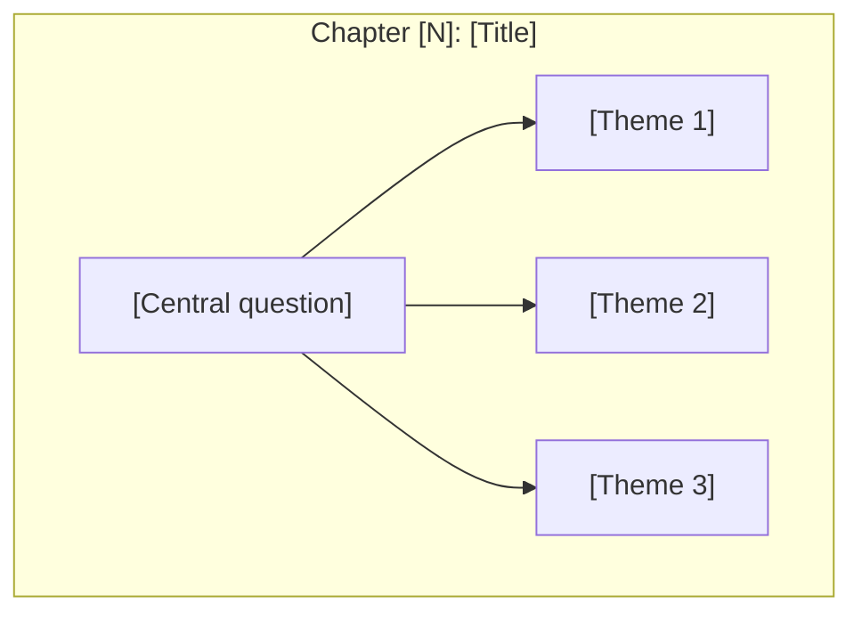
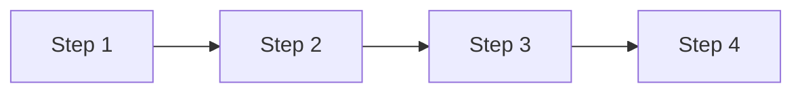

# Skill: Book to Visual Learning Companion

## Overview

This skill transforms a book into a comprehensive visual learning companion website featuring:
- **Custom designed landing page** using frontend-design principles
- Chapter-by-chapter visual diagrams
- Concept maps showing idea relationships
- Cross-linked concept pages
- Guided learning paths
- Full-text search
- Dark mode support

## Prerequisites

- Node.js 18+
- Book content (PDF, EPUB, or text)
- Claude Code with file read permissions

### Version Pinning

This skill targets **Astro 5**. Key version requirements:

```json
{
  "astro": "^5.0.0",
  "@astrojs/starlight": "^0.32.0",
  "astro-mermaid": "^0.3.0"
}
```

### Pre-flight Checks

Before starting, verify the environment:

```bash
# Check Node version (must be 18+)
node --version

# Check git identity (needed for commits/deploy)
git config user.name && git config user.email || echo "WARNING: git identity not set"

# Check disk space (Astro builds can use ~500MB for node_modules + dist)
df -h .
```

### Content Provenance

If the user provides a PDF/EPUB, extract text directly from it. If no source file is available, **clearly state** that content is synthesized from knowledge and may not match the original text word-for-word. Never present synthesized content as verbatim book text without disclosure.

## Workflow

### Phase 1: Book Analysis

**Step 1.1: Extract Book Structure**

```
When given a book PDF or text:

1. IDENTIFY the book's structure:
   - Title and author
   - Number of chapters/parts
   - Chapter titles
   - Section/essay breakdown within chapters

2. CREATE a structure map:
   ```
   Book: [Title]
   Author: [Author]
   Parts: [Number]
   Chapters: [Number]

   Structure:
   - Part I: [Name]
     - Chapter 1: [Title]
       - 1.1 [Essay/Section]
       - 1.2 [Essay/Section]
     - Chapter 2: [Title]
   ...
   ```

3. IDENTIFY key concepts:
   - Central thesis/main idea
   - Key terms introduced
   - Recurring themes
   - Relationships between concepts

4. EXTRACT visual identity:
   - Core metaphors or symbols from the book
   - Suggested color palette based on book themes
   - Key iconography (e.g., Triad for Antifragile)
```

**Step 1.1b: Genre Classification**

Classify the book into one PRIMARY genre using these signals:

| Genre | Signals |
|-------|---------|
| **TECHNICAL** | Code samples, architecture diagrams, API references, system design, algorithms, data models |
| **BUSINESS** | Frameworks, case studies, competitive analysis, market data, strategy models, org design |
| **NARRATIVE** | Chronological events, historical figures, cause-effect storytelling, scientific discoveries |
| **PHILOSOPHICAL** | Abstract arguments, thought experiments, conceptual distinctions, dialectical structure |

If the book spans genres, assign a SECONDARY genre. Tag each chapter as PRIMARY or SECONDARY during the structure map. Book-level pages (overview, concept pages) always use the PRIMARY genre.

**Step 1.1c: Load Visualization Sub-Skill**

Based on the genre classification, load the corresponding visualization sub-skill:
- TECHNICAL → `viz-technical` sub-skill
- BUSINESS → `viz-business` sub-skill
- NARRATIVE → `viz-narrative` sub-skill
- PHILOSOPHICAL → `viz-philosophical` sub-skill

If a SECONDARY genre was assigned, also load its sub-skill for chapters tagged with that genre. Use the PRIMARY genre's sub-skill for all book-level pages and the default color palette.

**Step 1.2: Concept Extraction**

```
For each chapter, identify:

1. CORE INSIGHT: The main idea in 1-2 sentences
2. KEY CONCEPTS: Terms or ideas introduced
3. RELATIONSHIPS: How concepts connect to:
   - Previous chapters
   - Other concepts in same chapter
   - Overall book thesis
4. VISUAL POTENTIAL: Use the Chapter Analysis Template from the loaded
   visualization sub-skill (Section C) to assess this chapter's visual content.
   Answer all questions in the template for this chapter.
5. ICONIC QUOTE: A memorable quote that captures the chapter essence
```

### Phase 2: Project Setup

**Step 2.1: Initialize Astro/Starlight Project**

```bash
# Create project directory
mkdir [book-slug]-visual
cd [book-slug]-visual

# Initialize Astro with Starlight
# NOTE: npm create can timeout in automated environments.
# If it hangs, use --skip-houston and run npm install separately.
npm create astro@latest . -- --template starlight --yes --no-git --skip-houston

# Install dependencies
npm install

# Add Mermaid support
npm install astro-mermaid mermaid
```

> **Environment note**: In WSL2 or CI environments, `npm create` may timeout during dependency installation. If this happens, the project directory will exist but `node_modules/` will be empty. Simply run `npm install` manually to recover.

**Step 2.2: Configure Project**

Create `astro.config.mjs`:

```javascript
// @ts-check
import { defineConfig } from 'astro/config';
import starlight from '@astrojs/starlight';
import mermaid from 'astro-mermaid';

export default defineConfig({
  integrations: [
    // Mermaid MUST come before Starlight
    mermaid(),
    starlight({
      title: '[Book Title] Visual',
      description: 'A visual learning companion for [Book Title]',
      customCss: ['./src/styles/custom.css'],
      sidebar: [
        { label: 'Book Overview', slug: 'overview' },
        {
          label: 'Chapters',
          autogenerate: { directory: 'chapters' },
        },
        {
          label: 'Core Concepts',
          autogenerate: { directory: 'concepts' },
        },
        {
          label: 'Learning Paths',
          autogenerate: { directory: 'paths' },
        },
      ],
    }),
  ],
});
```

**Step 2.3: Create Directory Structure**

```
src/
├── pages/
│   └── index.astro              # CUSTOM LANDING PAGE (frontend-design)
├── content/docs/
│   ├── overview.mdx             # Book overview (Starlight)
│   ├── chapters/                # Book chapters
│   │   ├── 01-[chapter-slug]/
│   │   │   └── overview.md      # Chapter overview
│   │   └── 02-[chapter-slug]/
│   ├── concepts/                # Cross-chapter concepts
│   │   └── [concept].md
│   └── paths/                   # Guided learning paths
│       └── [path-name].md
└── styles/
    └── custom.css               # Theme colors
```

### Phase 3: Landing Page Design (CRITICAL - Use frontend-design skill)

**Step 3.1: Invoke Frontend Design Skill**

For the landing page, ALWAYS use the frontend-design skill with this prompt pattern:

```
Create a visually striking landing page for the [Book Title] Visual Companion website -
a learning companion for [Author]'s book "[Full Book Title]".

The page should have:
1) Hero section with compelling visual design representing [KEY VISUAL METAPHOR FROM BOOK]
2) Key quote from the book: "[ICONIC QUOTE]"
3) Author attribution
4) Visual representation of the journey through [N] parts/books
5) Core concepts grid with symbolic icons
6) Learning paths section (Beginner/Intermediate/Advanced)
7) Call-to-action to enter the learning experience

Use the color palette:
- Primary concept: #[color] ([description])
- Secondary concept: #[color] ([description])
- Tertiary concept: #[color] ([description])

Make it feel premium, philosophical, and intellectually engaging.
```

**Step 3.2: Landing Page Template Structure**

Create `src/pages/index.astro` with this structure:

```astro
---
// Custom landing page for [Book Title] Visual Companion
---
<!DOCTYPE html>
<html lang="en">
<head>
  <meta charset="UTF-8" />
  <meta name="viewport" content="width=device-width, initial-scale=1.0" />
  <title>[Book Title] Visual Companion</title>
  <meta name="description" content="Visual learning companion for [Book Title] by [Author]" />

  <!-- Premium Typography -->
  <link rel="preconnect" href="https://fonts.googleapis.com" />
  <link rel="preconnect" href="https://fonts.gstatic.com" crossorigin />
  <link href="https://fonts.googleapis.com/css2?family=Cormorant+Garamond:ital,wght@0,400;0,600;1,400&family=Instrument+Sans:wght@400;500;600&family=JetBrains+Mono:wght@400&display=swap" rel="stylesheet" />

  <style>
    /* CSS Variables for theming */
    :root {
      --bg-dark: #0a0a0b;
      --bg-section: #111113;
      --text-primary: #f5f5f5;
      --text-secondary: #a0a0a0;
      --text-muted: #666;

      /* Book-specific colors - customize per book */
      --concept-primary: #c8e6c9;    /* e.g., Antifragile green */
      --concept-secondary: #fff9c4;  /* e.g., Robust yellow */
      --concept-tertiary: #ffcdd2;   /* e.g., Fragile red */
      --accent: #4a9f4d;

      --font-display: 'Cormorant Garamond', Georgia, serif;
      --font-body: 'Instrument Sans', system-ui, sans-serif;
      --font-mono: 'JetBrains Mono', monospace;
    }

    * { margin: 0; padding: 0; box-sizing: border-box; }

    body {
      font-family: var(--font-body);
      background: var(--bg-dark);
      color: var(--text-primary);
      line-height: 1.6;
    }

    /* Hero Section */
    .hero {
      min-height: 100vh;
      display: flex;
      flex-direction: column;
      align-items: center;
      justify-content: center;
      padding: 4rem 2rem;
      text-align: center;
      position: relative;
      overflow: hidden;
    }

    /* Visual Element Container - Book-specific visual metaphor */
    .visual-metaphor {
      display: flex;
      align-items: center;
      justify-content: center;
      gap: 2rem;
      margin-bottom: 3rem;
    }

    /* Title Styling */
    .hero h1 {
      font-family: var(--font-display);
      font-size: clamp(3rem, 10vw, 6rem);
      font-weight: 400;
      font-style: italic;
      letter-spacing: -0.02em;
      margin-bottom: 0.5rem;
    }

    .subtitle {
      font-family: var(--font-mono);
      font-size: 0.875rem;
      letter-spacing: 0.3em;
      text-transform: uppercase;
      color: var(--text-muted);
      margin-bottom: 3rem;
    }

    /* Quote Section */
    .quote-section {
      max-width: 700px;
      margin-bottom: 3rem;
    }

    .quote {
      font-family: var(--font-display);
      font-size: 1.5rem;
      font-style: italic;
      color: var(--text-secondary);
      line-height: 1.8;
      margin-bottom: 1.5rem;
    }

    .author-name {
      font-family: var(--font-body);
      font-weight: 500;
      color: var(--text-primary);
    }

    .book-title-attr {
      font-size: 0.875rem;
      color: var(--text-muted);
    }

    /* CTA Buttons */
    .cta-group {
      display: flex;
      gap: 1rem;
      flex-wrap: wrap;
      justify-content: center;
    }

    .btn-primary {
      background: var(--accent);
      color: white;
      padding: 1rem 2rem;
      border-radius: 4px;
      text-decoration: none;
      font-weight: 500;
      transition: transform 0.2s, box-shadow 0.2s;
    }

    .btn-primary:hover {
      transform: translateY(-2px);
      box-shadow: 0 4px 20px rgba(74, 159, 77, 0.3);
    }

    .btn-secondary {
      background: transparent;
      color: var(--text-primary);
      padding: 1rem 2rem;
      border: 1px solid var(--text-muted);
      border-radius: 4px;
      text-decoration: none;
      font-weight: 500;
      transition: border-color 0.2s;
    }

    .btn-secondary:hover {
      border-color: var(--text-primary);
    }

    /* Sections */
    section {
      padding: 6rem 2rem;
    }

    .section-dark {
      background: var(--bg-section);
    }

    .section-title {
      font-family: var(--font-display);
      font-size: 2.5rem;
      font-style: italic;
      text-align: center;
      margin-bottom: 1rem;
    }

    .section-subtitle {
      text-align: center;
      color: var(--text-secondary);
      max-width: 600px;
      margin: 0 auto 3rem;
    }

    /* Parts/Books Grid */
    .parts-grid {
      display: grid;
      grid-template-columns: repeat(auto-fit, minmax(280px, 1fr));
      gap: 1.5rem;
      max-width: 1200px;
      margin: 0 auto;
    }

    .part-card {
      background: rgba(255,255,255,0.02);
      border: 1px solid rgba(255,255,255,0.05);
      border-left: 3px solid var(--concept-primary);
      padding: 1.5rem;
      text-decoration: none;
      color: inherit;
      transition: background 0.2s, transform 0.2s;
    }

    .part-card:hover {
      background: rgba(255,255,255,0.05);
      transform: translateX(4px);
    }

    .part-number {
      font-family: var(--font-display);
      font-size: 3rem;
      color: rgba(255,255,255,0.1);
      float: right;
    }

    .part-title {
      font-family: var(--font-display);
      font-size: 1.25rem;
      margin-bottom: 0.5rem;
    }

    .part-chapters {
      font-family: var(--font-mono);
      font-size: 0.75rem;
      color: var(--concept-primary);
      margin-bottom: 0.5rem;
    }

    .part-desc {
      font-size: 0.9rem;
      color: var(--text-secondary);
    }

    /* Concepts Grid */
    .concepts-grid {
      display: grid;
      grid-template-columns: repeat(auto-fit, minmax(200px, 1fr));
      gap: 1px;
      background: rgba(255,255,255,0.05);
      border: 1px solid rgba(255,255,255,0.05);
      border-radius: 8px;
      overflow: hidden;
      max-width: 900px;
      margin: 0 auto;
    }

    .concept-card {
      background: var(--bg-dark);
      padding: 2rem 1.5rem;
      text-align: center;
      text-decoration: none;
      color: inherit;
      transition: background 0.2s;
    }

    .concept-card:hover {
      background: rgba(255,255,255,0.05);
    }

    .concept-icon {
      font-size: 1.5rem;
      margin-bottom: 0.75rem;
      color: var(--concept-primary);
    }

    .concept-name {
      font-family: var(--font-display);
      font-size: 1.1rem;
      margin-bottom: 0.5rem;
    }

    .concept-brief {
      font-size: 0.8rem;
      color: var(--text-secondary);
    }

    /* Learning Paths */
    .paths-grid {
      display: grid;
      grid-template-columns: repeat(auto-fit, minmax(280px, 1fr));
      gap: 1.5rem;
      max-width: 1000px;
      margin: 0 auto;
    }

    .path-card {
      background: var(--bg-dark);
      border: 1px solid rgba(255,255,255,0.1);
      border-radius: 8px;
      padding: 2rem;
      text-decoration: none;
      color: inherit;
      transition: border-color 0.2s;
    }

    .path-card:hover {
      border-color: var(--concept-primary);
    }

    .path-level {
      display: inline-block;
      font-size: 0.75rem;
      padding: 0.25rem 0.75rem;
      border-radius: 100px;
      background: rgba(200, 230, 201, 0.1);
      color: var(--concept-primary);
      margin-bottom: 1rem;
    }

    .path-title {
      font-family: var(--font-display);
      font-size: 1.5rem;
      margin-bottom: 0.75rem;
    }

    .path-desc {
      font-size: 0.9rem;
      color: var(--text-secondary);
      margin-bottom: 1rem;
    }

    .path-meta {
      font-family: var(--font-mono);
      font-size: 0.75rem;
      color: var(--text-muted);
    }

    /* Final CTA */
    .final-cta {
      text-align: center;
      padding: 6rem 2rem;
    }

    .final-cta h2 {
      font-family: var(--font-display);
      font-size: 2.5rem;
      font-style: italic;
      margin-bottom: 1rem;
    }

    .final-cta p {
      color: var(--text-secondary);
      margin-bottom: 2rem;
    }

    /* Footer */
    footer {
      text-align: center;
      padding: 2rem;
      color: var(--text-muted);
      font-size: 0.875rem;
      border-top: 1px solid rgba(255,255,255,0.05);
    }

    footer a {
      color: var(--text-secondary);
    }

    /* Scroll Animation */
    .fade-in {
      opacity: 0;
      transform: translateY(20px);
      transition: opacity 0.6s ease, transform 0.6s ease;
    }

    .fade-in.visible {
      opacity: 1;
      transform: translateY(0);
    }
  </style>
</head>
<body>
  <!-- HERO SECTION -->
  <section class="hero">
    <!-- Visual Metaphor - Customize per book -->
    <div class="visual-metaphor">
      <!-- Example: Triad shapes for Antifragile -->
      <!-- Replace with book-specific visual elements -->
    </div>

    <div class="title-group">
      <h1>[Book Title]</h1>
      <p class="subtitle">Visual Learning Companion</p>
    </div>

    <div class="quote-section">
      <blockquote class="quote">
        "[Iconic quote from the book that captures its essence]"
      </blockquote>
      <div class="attribution">
        <span class="author-name">[Author Name]</span>
        <p class="book-title-attr">Author of [Full Book Title]</p>
      </div>
    </div>

    <div class="cta-group">
      <a href="/paths/[intro-path]/" class="btn-primary">Begin Your Journey</a>
      <a href="/concepts/[main-concept]/" class="btn-secondary">Explore Concepts</a>
    </div>

    <div class="scroll-indicator">
      <span>Discover</span>
    </div>
  </section>

  <!-- PARTS/BOOKS JOURNEY -->
  <section class="section-dark">
    <h2 class="section-title">The Journey Through [N] [Parts/Books]</h2>
    <p class="section-subtitle">
      Navigate through [N] chapters exploring [brief description of book's purpose].
    </p>
    <div class="parts-grid">
      <!-- Repeat for each Part/Book -->
      <a href="/chapters/01-[slug]/overview/" class="part-card fade-in">
        <span class="part-number">I</span>
        <h3 class="part-title">[Part Title]</h3>
        <p class="part-chapters">Chapters 1-4</p>
        <p class="part-desc">[Brief description of what this part covers]</p>
      </a>
      <!-- More part cards... -->
    </div>
  </section>

  <!-- CORE CONCEPTS -->
  <section>
    <h2 class="section-title">Core Concepts</h2>
    <p class="section-subtitle">
      Master the fundamental ideas that form the foundation of [book's philosophy].
    </p>
    <div class="concepts-grid">
      <!-- Repeat for each concept with symbolic icon -->
      <a href="/concepts/[concept-slug]/" class="concept-card fade-in">
        <div class="concept-icon">[Symbol]</div>
        <h4 class="concept-name">[Concept Name]</h4>
        <p class="concept-brief">[One-line description]</p>
      </a>
      <!-- More concept cards... -->
    </div>
  </section>

  <!-- LEARNING PATHS -->
  <section class="section-dark">
    <h2 class="section-title">Choose Your Path</h2>
    <p class="section-subtitle">
      Structured learning journeys from foundational concepts to advanced application.
    </p>
    <div class="paths-grid">
      <a href="/paths/[intro-path]/" class="path-card fade-in">
        <span class="path-level">Beginner</span>
        <h3 class="path-title">[Path Name]</h3>
        <p class="path-desc">[Description of what this path covers and who it's for]</p>
        <p class="path-meta">[Parts covered] · [N] Chapters</p>
      </a>
      <a href="/paths/[intermediate-path]/" class="path-card fade-in">
        <span class="path-level">Intermediate</span>
        <h3 class="path-title">[Path Name]</h3>
        <p class="path-desc">[Description]</p>
        <p class="path-meta">[Parts covered] · [N] Chapters</p>
      </a>
      <a href="/paths/[advanced-path]/" class="path-card fade-in">
        <span class="path-level">Advanced</span>
        <h3 class="path-title">[Path Name]</h3>
        <p class="path-desc">[Description]</p>
        <p class="path-meta">[Parts covered] · [N] Chapters</p>
      </a>
    </div>
  </section>

  <!-- FINAL CTA -->
  <section class="final-cta">
    <h2>Ready to [Action verb related to book]?</h2>
    <p>Transform how you think about [book's subject matter].</p>
    <a href="/paths/[intro-path]/" class="btn-primary">Start Learning Now</a>
  </section>

  <!-- FOOTER -->
  <footer>
    <p>A visual learning companion for <a href="[Amazon/book link]">[Full Book Title]</a> by [Author]</p>
  </footer>

  <!-- Scroll Animation Script -->
  <script>
    document.addEventListener('DOMContentLoaded', () => {
      const observer = new IntersectionObserver((entries) => {
        entries.forEach(entry => {
          if (entry.isIntersecting) {
            entry.target.classList.add('visible');
          }
        });
      }, { threshold: 0.1 });

      document.querySelectorAll('.fade-in').forEach(el => observer.observe(el));
    });
  </script>
</body>
</html>
```

**Step 3.3: Visual Metaphor Examples**

Each book should have a unique visual metaphor in the hero section:

| Book | Visual Metaphor | Implementation |
|------|-----------------|----------------|
| Antifragile | The Triad (Star/Square/Triangle) | CSS clip-path shapes with floating animation |
| Thinking Fast & Slow | Two Systems (1 & 2) | Animated numbers or brain hemispheres |
| Black Swan | Swan silhouette | SVG with gradient |
| Atomic Habits | Compound curve | SVG path animation |
| Zero to One | 0 → 1 transition | Number morph animation |

### Phase 4: Content Generation

**Step 4.1: Book Overview Page**

Create `src/content/docs/overview.mdx` (replaces index.mdx):

```markdown
---
title: Book Overview
description: 'Complete overview of [Book Title] by [Author]'
---

import { Card, CardGrid } from '@astrojs/starlight/components';

## The Central Idea: [Core Concept]

[2-3 paragraphs explaining the book's main thesis]

```mermaid
flowchart LR
    [Main concept diagram showing book's central framework]
```

> "[Key quote from book]"
> <cite>— [Author]</cite>

---

## Book Structure

<CardGrid>
  <Card title="[Part I Title]" icon="rocket">
    **Chapters 1-N**: [Brief description]

    [Start Part I →](/chapters/01-[slug]/overview/)
  </Card>
  <!-- More cards for each part -->
</CardGrid>

---

## Core Concepts

```mermaid
mindmap
  root(([Central Concept]))
    [Branch 1]
    [Branch 2]
    [Branch 3]
```

<CardGrid>
  <Card title="[Concept]" icon="[icon]">
    [Brief description]

    [Learn more →](/concepts/[slug]/)
  </Card>
  <!-- More concept cards -->
</CardGrid>

---

## Learning Paths

<CardGrid>
  <Card title="[Path Name]" icon="rocket">
    **[Parts covered]** | [Audience]

    [Description]

    [Begin Path →](/paths/[slug]/)
  </Card>
  <!-- More path cards -->
</CardGrid>

---

## Key Comparisons

| Aspect | [Category 1] | [Category 2] | [Category 3] |
|--------|--------------|--------------|--------------|
| **[Row 1]** | [Value] | [Value] | [Value] |
| **[Row 2]** | [Value] | [Value] | [Value] |

---

## About This Companion

This visual learning companion transforms the content of *[Book Title]* into digestible visual representations using:

- **Mermaid Diagrams**: Flowcharts, mindmaps, and concept maps
- **[Framework]**: [Description of visual framework]
- **Progressive Learning**: Three guided paths from foundational to advanced
- **Cross-References**: Concepts linked across all chapters
```

**Step 4.2: Chapter Overview Template**

```markdown
---
title: "Chapter [N]: [Title]"
description: "[Brief description]"
---

# Chapter [N]: [Title]

[1-2 paragraph introduction to chapter themes]

## Chapter Overview



## Sections in This Chapter

| Section | Title | Key Idea |
|---------|-------|----------|
| [N.1](/chapters/[slug]/[section]/) | [Title] | [One-line summary] |
| [N.2](/chapters/[slug]/[section]/) | [Title] | [One-line summary] |

## Key Themes

- **[Theme 1]** — [Brief explanation]
- **[Theme 2]** — [Brief explanation]

## Related Concepts

- [Concept 1](/concepts/[slug]/)
- [Concept 2](/concepts/[slug]/)
```

**Step 4.3: Concept Page Template**

```markdown
---
title: "[Concept Name]"
description: "Cross-chapter exploration of [concept]"
---

# [Concept Name]

[Definition and importance in 2-3 sentences]

## Concept Overview

```mermaid
mindmap
  root(([Concept]))
    [Branch 1]
      [Detail]
    [Branch 2]
      [Detail]
    [Branch 3]
      [Detail]
```

## [Main explanation sections]

## Where This Appears in the Book

| Chapter | Context | Key Insight |
|---------|---------|-------------|
| [Ch N](/chapters/...) | [Context] | [Insight] |

## Related Concepts

- [Concept 1](/concepts/[slug]/)
- [Concept 2](/concepts/[slug]/)
```

**Step 4.4: Learning Path Template**

```markdown
---
title: "Learning Path: [Name]"
description: "A guided journey through [topic]"
---

# Learning Path: [Name]

[Description of what this path covers and who it's for]

## Path Overview



---

## Step 1: [Title]

**Goal:** [What the reader will understand]

### Read
- [Link to content]

### Key Diagram

```mermaid
[Relevant diagram]
```

### Check Your Understanding
- [ ] [Question 1]
- [ ] [Question 2]

---

[Repeat for each step]

---

## Path Complete!

You now understand:
- [Learning outcome 1]
- [Learning outcome 2]

**Continue with:** [Next recommended content]
```

### Phase 5: Theme & Styling

**Step 5.1: Custom CSS**

Create `src/styles/custom.css`:

```css
/* Book-specific color palette */
:root {
  /* Primary concept colors - customize per book */
  --sl-color-accent: #4a9f4d;
  --sl-color-accent-low: rgba(74, 159, 77, 0.1);
  --sl-color-accent-high: #2e7d32;

  /* Concept-specific colors */
  --color-concept-1: #c8e6c9;
  --color-concept-2: #fff9c4;
  --color-concept-3: #ffcdd2;
  --color-concept-4: #e3f2fd;
  --color-concept-5: #f3e5f5;
}

/* Mermaid diagram theming */
.mermaid {
  background: transparent !important;
}

/* Custom callout boxes */
.concept-box {
  border-left: 4px solid var(--sl-color-accent);
  padding: 1rem;
  margin: 1rem 0;
  background: var(--sl-color-accent-low);
  border-radius: 0 8px 8px 0;
}

/* Quote styling */
blockquote {
  font-style: italic;
  border-left: 3px solid var(--sl-color-accent);
  padding-left: 1rem;
  margin: 2rem 0;
}

blockquote cite {
  display: block;
  margin-top: 0.5rem;
  font-style: normal;
  color: var(--sl-color-text-accent);
}
```

**Step 5.2: Mermaid File Extension Requirements**

> **Important**: The `astro-mermaid` remark plugin may only process Mermaid code blocks in files that go through Astro's full markdown pipeline. Verify which file types get processed:
>
> - `.mdx` files — **always processed** (Starlight's default pipeline)
> - `.md` files in `docs/` — **processed** if Starlight's remark chain includes astro-mermaid
>
> **Recommendation**: Use `.mdx` extension for any content file that contains Mermaid diagrams (chapter overviews, concept pages). After the first build, check the build log for `astro-mermaid` transform counts — if the count is lower than expected, switch affected `.md` files to `.mdx`.

---

### Phase 6: Diagram Guidelines

**Step 6.1: Apply Loaded Visualization Sub-Skill**

Use the visualization sub-skill loaded in Step 1.1c for all diagram decisions:

- **Color palette**: Use Section A → Color Palette from the loaded sub-skill
- **Diagram types**: Use Section A → Primary and Secondary Diagram Types from the loaded sub-skill
- **Diagram quantity**: Follow the sub-skill's per-chapter range (e.g., 3-7 for technical, 2-5 for philosophical)
- **Visual narrative arc**: Follow the sub-skill's progression pattern (e.g., Layer-Down for technical, Dialectical for philosophical)
- **Complexity cap**: Respect the sub-skill's maximum node count per diagram

**Step 6.2: Per-Chapter Genre Switching**

If the book has a SECONDARY genre:
- For chapters tagged with the SECONDARY genre, use that genre's sub-skill for diagrams
- For all other chapters, use the PRIMARY genre's sub-skill
- Book-level pages (overview, concept pages) always use the PRIMARY genre's sub-skill and color palette

### Phase 7: Build and Deploy

**Step 7.1: Incremental Build Checkpoint**

After creating the project scaffold AND before generating all content, run the first build:

```bash
npm run build
```

This validates Astro and Starlight are properly installed and content collections compile. If this fails, fix it before generating all chapters.

> **Lesson learned**: Do not wait until the end to build. Build incrementally — after scaffold setup, after the first chapter, and then the full build. This catches errors early.

**Step 7.2: Final Build**

```bash
npm run build
```

After build completes, verify:
1. Build output shows all expected routes
2. `astro-mermaid` log shows expected mermaid block count
3. No 404 warnings for content entries

**Step 7.3: Smoke Test**

```bash
npm run preview &
curl -s -o /dev/null -w "%{http_code}" http://localhost:4321/
curl -s -o /dev/null -w "%{http_code}" http://localhost:4321/overview/
kill %1
```

> **Why smoke test?** HTTP 200 from the dev server doesn't guarantee the production build works.

**Step 7.4: Deployment**

```bash
# Initialize git (if not already)
git init && git add -A && git commit -m "Initial companion site"

# Vercel (recommended) — auto-detects Astro
vercel deploy --prod --yes

# Or build and deploy static files
npm run build
# Upload dist/ to any static host
```

**Step 7.5: Post-Deploy Verification**

After deploying to Vercel:
- Check the deployment status: `vercel ls`
- If the URL returns 401, Deployment Protection may be enabled — disable it in Vercel Dashboard → Project → Settings → Deployment Protection for public access

## Example Execution

When user provides: "Create a visual companion for [Book Title]"

1. **Analyze**: Read the book/PDF, extract structure and visual identity
2. **Plan**: Create chapter list, identify key concepts and color palette
3. **Setup**: Initialize Astro/Starlight project
4. **Design Landing**: Use frontend-design skill for custom landing page
5. **Generate Content**: Create chapter, concept, and path pages with diagrams
6. **Configure**: Set up navigation and styling
7. **Test**: Build and verify all pages
8. **Deploy**: Start local server or deploy to Vercel

## Agent Strategy

### Model Selection

When executing this skill with Claude Code's Task tool, use the right model for each phase:

| Phase | Recommended Model | Rationale |
|-------|-------------------|-----------|
| 1. Book Analysis | **Opus** | Structural reasoning, concept extraction |
| 2. Project Setup | Sonnet | Scaffolding, config files |
| 3. Landing Page | Sonnet | HTML/CSS generation from spec |
| 4. Content Generation | Sonnet | Template-driven content generation |
| 5. Styling | Sonnet | CSS from design tokens |
| 6. Diagram Review | **Opus** | Quality judgment on what to visualize |
| 7. Build & Debug | **Opus** | Diagnosing build errors requires deeper reasoning |

**~70% of work can use Sonnet, saving ~60% in token costs.**

### Parallelization

Phases 3–5 can be parallelized (landing page, companion content, styling are independent). Run a build checkpoint after Phase 2 to validate the scaffold before generating all content.

---

## Best Practices

### Landing Page (frontend-design)
- Unique visual metaphor representing book's core concept
- Premium typography (display + body + mono fonts)
- Dark atmospheric design for intellectual content
- Scroll-triggered animations for engagement
- Clear visual hierarchy and CTAs

### Content
- Start with core insight, then details
- Use quotes from original when available
- Keep explanations accessible
- Include reflection questions
- Cross-link extensively

### Diagrams
- Follow the loaded visualization sub-skill's diagram quantity range, visual narrative arc, and complexity guidelines
- Use the sub-skill's color palette consistently across all diagrams
- Progressive reveal for complex topics
- Label clearly
- Keep diagrams focused — respect the sub-skill's node complexity cap

### Navigation
- Custom landing page → Starlight documentation
- Dual navigation: by chapter AND by concept
- Clear hierarchy with collapsible sections
- Learning paths for guided experience

## Troubleshooting

### `entry.render is not a function` (Astro 5 API Change)
- **Cause**: Using Astro 4's `entry.render()` instead of Astro 5's standalone `render(entry)`
- **Fix**: Change `const { Content } = await entry.render()` to:
  ```typescript
  import { getCollection, render } from 'astro:content';
  const { Content } = await render(entry);
  ```
- This is relevant if you add custom reader pages that render content from collections using the `glob` loader

### Mermaid Blocks Rendering as Code
- Companion content files with Mermaid diagrams should use `.mdx` extension, not `.md`
- Check the build log for `astro-mermaid` transform counts
- If count is 0 or lower than expected, switch affected files to `.mdx`

### Custom Landing Page Not Showing
- Ensure `src/pages/index.astro` exists
- Rename `src/content/docs/index.mdx` to `overview.mdx`
- Add "Book Overview" to sidebar in config

### Mermaid Not Rendering
- Ensure `astro-mermaid` comes BEFORE `starlight` in config
- Check diagram syntax
- Verify code block uses `mermaid` language

### Build Fails
- Check all linked files exist
- Verify frontmatter YAML syntax
- Look for unclosed code blocks

## Output

The skill produces:
- Custom-designed landing page (frontend-design)
- Complete Astro/Starlight documentation
- All chapter content with Mermaid diagrams
- Concept pages with cross-links
- Learning paths
- Search functionality
- Dark mode support
- Ready for deployment
