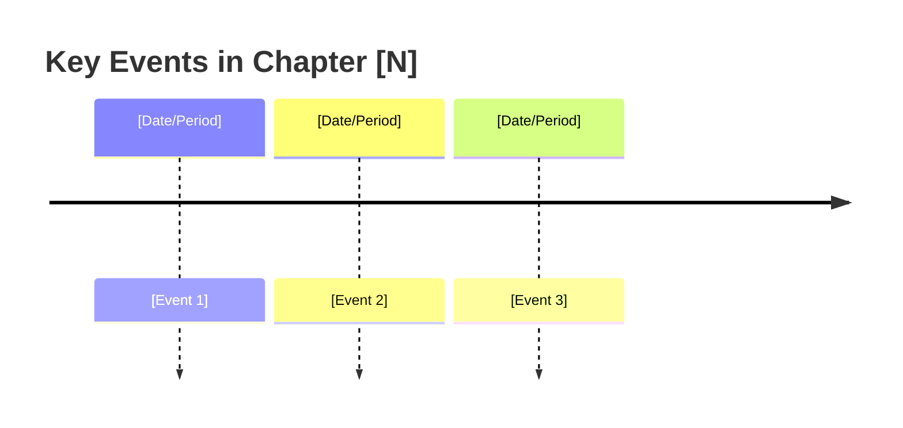

# Visualization Sub-Skill: Narrative / History / Science Books

This sub-skill is loaded by parent companion skills (visual, dual, adaptive) when the book is classified as NARRATIVE genre during Phase 1.

---

## A. Visualization Strategy

### Diagram Quantity
- **2-5 diagrams per chapter** (narrative prose has fewer diagrammable structures than technical or business content; quality over quantity)

### Primary Diagram Types
| Diagram Type | Best For |
|-------------|----------|
| `timeline` | Chronological events, historical periods, discovery sequences |
| `flowchart` | Cause-effect chains, consequence cascades, decision points |
| `flowchart TB` with subgraphs | Taxonomies (science), classification trees, nested categories |
| `mindmap` | Thematic chapters, concept summaries, character/actor networks |

### Secondary Diagram Types
| Diagram Type | Best For |
|-------------|----------|
| `sequenceDiagram` | Actor interactions, diplomatic exchanges, debate flows |
| `gantt` | Overlapping historical periods, parallel timelines, project phases |
| `pie` | Distributions, proportions, demographic breakdowns |
| `flowchart LR` | Linear narratives, migration paths, evolutionary sequences |

### Visual Narrative Arc: **Chronological-Causal**
Each chapter's diagrams should follow this progression:
1. **Timeline** — establish the temporal scope and key events of the chapter
2. **Cause-effect chains** — show why events happened and what they caused
3. **Taxonomies / classifications** — categorize the entities, species, or concepts discussed
4. **Consequences / legacy** — connect events to their long-term impact or significance

### Color Palette
| Role | Color | Hex | Usage |
|------|-------|-----|-------|
| Events | Blue | `#bbdefb` | Key events, dates, milestones |
| Causes | Orange | `#ffe0b2` | Root causes, preconditions, triggers |
| Outcomes | Green | `#c8e6c9` | Results, consequences, legacy effects |
| Conflicts | Pink | `#f8bbd0` | Wars, debates, tensions, oppositions |
| Context | White/Light | `#f5f5f5` | Background info, setting, environment |
| Discoveries | Yellow | `#fff9c4` | Scientific findings, revelations, breakthroughs |

### Complexity Cap
- **15 nodes maximum** per diagram
- Timelines should cover no more than 8-10 events per diagram; split into sub-timelines for longer spans
- Cause-effect chains should be 3-5 steps deep maximum

---

## B. Content Strategy

### Section Structure
Each chapter's companion content should follow this pattern:
1. **The Setting** — When and where does this chapter take place? What is the context?
2. **What Happened** — Key events, discoveries, or narrative developments
3. **Why It Matters** — The significance, implications, or lessons of the events
4. **The Bigger Picture** — How this connects to the book's overarching narrative or thesis

### Callout Types
Use these Starlight callout types consistently:
- `:::note[Key Figure]` — Important people, scientists, historical actors, or organizations
- `:::tip[Turning Point]` — Pivotal moments that changed the direction of events
- `:::caution[Contested Interpretation]` — Areas where historians, scientists, or experts disagree
- `:::note[Primary Source]` — Direct quotes from historical documents, letters, or original research

### Chapter End Section
Each chapter companion page should end with:

**Chapter Timeline** + **Threads to Follow**
```markdown
## Chapter Timeline



## Threads to Follow

- **[Thread 1]**: Continues in [Chapter X](/chapters/XX-slug/overview/) — [brief note]
- **[Thread 2]**: See concept page [Concept](/concepts/slug/) for cross-chapter analysis
- **[Thread 3]**: Connects to [broader theme] explored in [Part/Chapter]
```

---

## C. Chapter Analysis Template

When analyzing each chapter during Phase 1, answer these 8 questions to guide visualization:

```
NARRATIVE CHAPTER ANALYSIS — Chapter [N]: [Title]

1. TEMPORAL SCOPE: What time period does this chapter cover?
   (Single event / decade / century / geological era)

2. KEY ACTORS: Who are the main people, organizations, or entities?
   (Names, roles, relationships between them)

3. CAUSAL CHAIN: What is the main cause-effect sequence?
   (Event A caused B, which led to C, resulting in D)

4. TURNING POINTS: Are there pivotal moments where things changed direction?
   (Decisions, discoveries, battles, accidents, breakthroughs)

5. TAXONOMY: Does the chapter classify or categorize things?
   (Species, types, categories, schools of thought)

6. PARALLEL THREADS: Are multiple storylines or timelines running simultaneously?
   (Concurrent events in different locations, parallel developments)

7. DISCOVERY LOGIC: For science books — what was the reasoning process?
   (Hypothesis → experiment → result → revision)

8. VISUAL DENSITY (1-5): How diagram-heavy should this chapter be?
   1 = Pure narrative, few structures (1-2 diagrams)
   3 = Moderate events and causes (2-3 diagrams)
   5 = Complex timeline with many actors (4-5 diagrams)
```

---

## D. Multi-Genre Handling

When a chapter is tagged with NARRATIVE as its secondary genre (primary is something else):
- Use `timeline` for any chronological content within the chapter
- Use `flowchart` for cause-effect sequences
- Apply the narrative color palette only to narrative-related diagram nodes
- Keep the primary genre's visual arc for the chapter's overall structure
- Limit narrative diagrams to sections that tell a story or describe historical events
